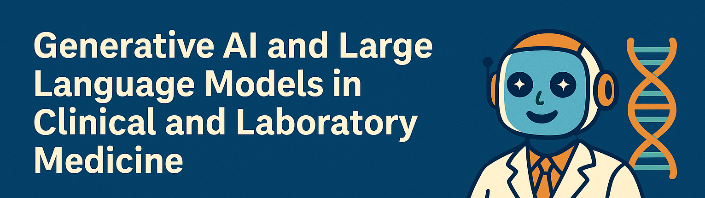
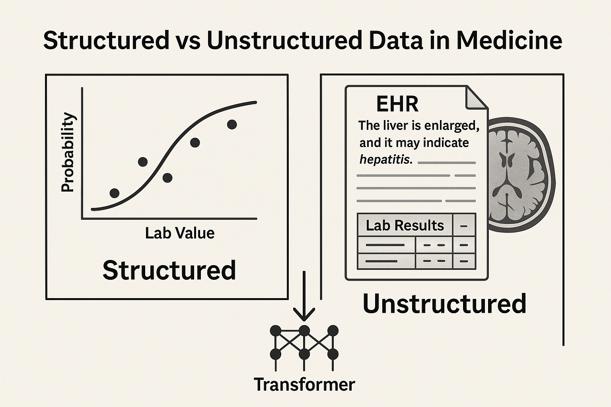
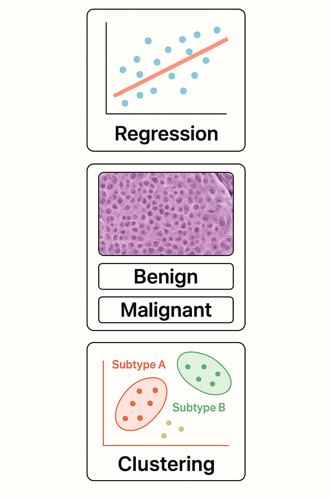
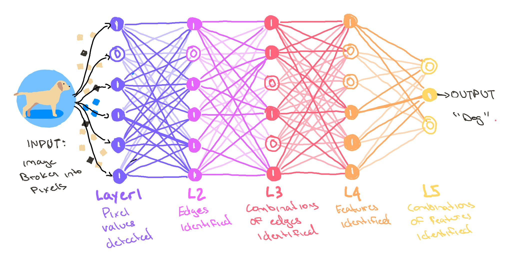
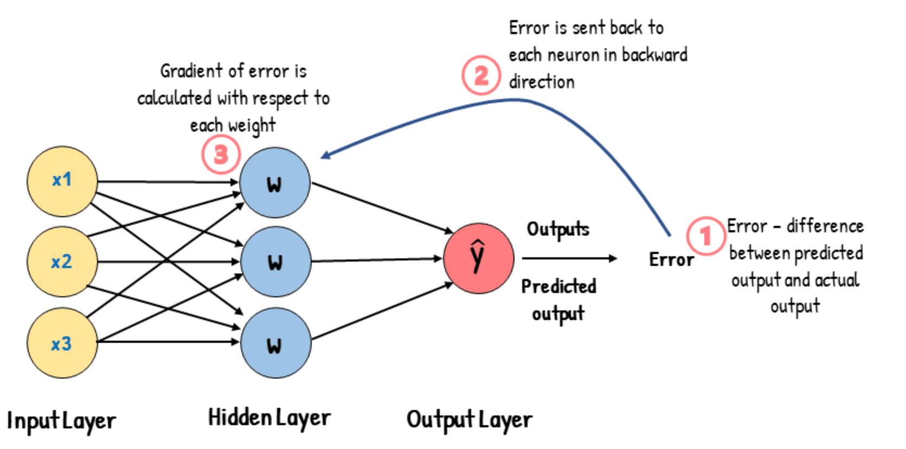
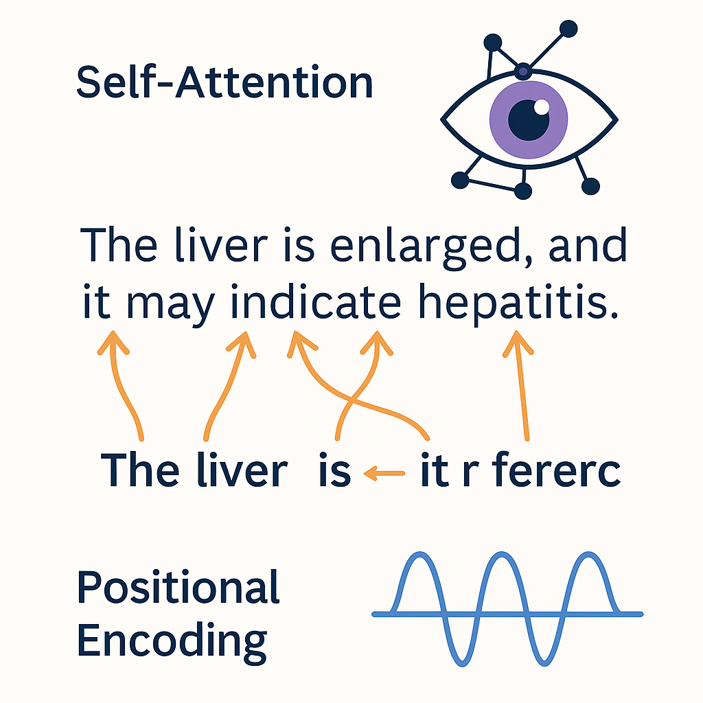
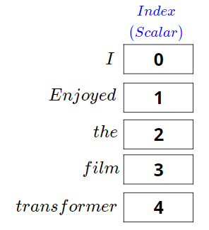
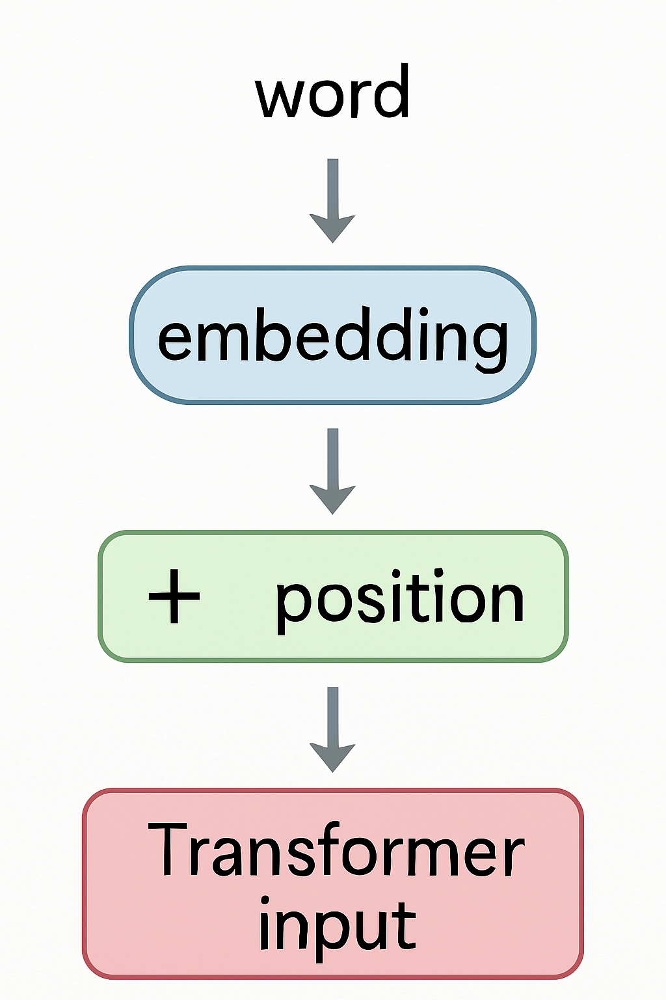
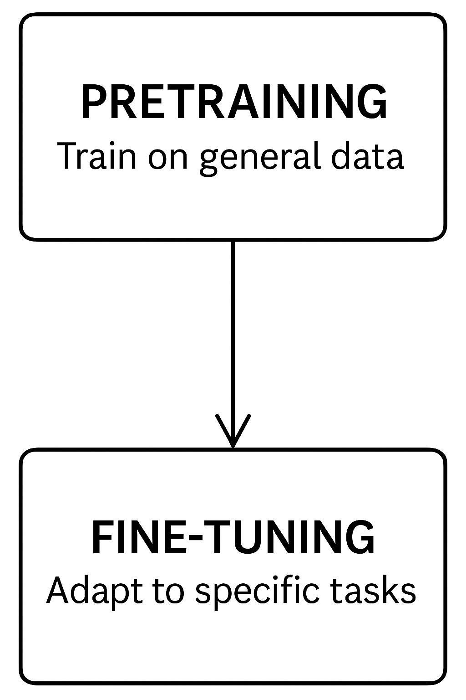

##

::: {.column width="100%"}

:::

## [AI Generativa e LLM]{style="color:#2E86C1;"}

### [in Medicina Clinica e di Laboratorio]{style="color:#117A65;"}

::: {style="font-size: 0.85em;"}
-   [Cos'è l'AI Generativa e come sta trasformando la medicina?]{style="color:#34495E;"}
-   [Perché concentrarsi sui Large Language Models (LLM)?]{style="color:#34495E;"}
-   <strong style="color:#2874A6;">Obiettivi chiave del corso:</strong>
    -   🧠 Comprendere i fondamenti dell'AI generativa e degli LLM
    -   🧪 Esplorare le applicazioni in ambito clinico e di laboratorio
    -   🔄 Confrontare strumenti locali vs commerciali (ChatGPT, Claude, Mistral, ecc.)
    -   🛠 Esercitarsi con LM Studio, WebLLM
-   <strong style="color:#7D3C98;">Formato del corso:</strong> 2 ore di teoria + 2 ore di pratica
:::

::: notes
Benvenuti al corso!
Siamo qui per esplorare come l'**AI Generativa** — e in particolare i **Large Language Models** — stiano rimodellando i campi medico e di laboratorio.
Questo non è un corso di programmazione; è un'introduzione pratica, focalizzata sul clinico, a strumenti come ChatGPT, Claude e Mistral, inclusi quelli che potete eseguire localmente per la privacy.
La struttura di oggi è semplice:
👉 Prima, capiamo come funzionano questi modelli.
👉 Poi, mettiamo le mani in pasta con strumenti come LM Studio.
Entro la fine, sarete in grado di provare prompt per la diagnostica, automatizzare la refertazione e persino pensare criticamente a quando *non* fidarsi di un LLM.
Iniziamo!
:::

---

## [Cos'è l'Intelligenza Artificiale?]{style="color:#1A5276;"}

### [(E perché medici e biologi dovrebbero interessarsene)]{style="color:#117A65;"}

::: {style="font-size: 0.85em;"}
-   🧠 **Intelligenza Artificiale (AI)** simula il ragionamento umano e il processo decisionale
-   🤖 Due approcci storici:
    -   <strong style="color:#2874A6;">AI Simbolica</strong> = logica basata su regole (es. sistemi esperti)
    -   <strong style="color:#AF7AC5;">AI Connessionista</strong> = ispirata al cervello (reti neurali)
-   📊 L'Apprendimento Statistico (Statistical Learning) fa da ponte:
    -   Tecniche basate sui dati per apprendere pattern dai dati
    -   Include regressione, classificazione e clustering
-   🧬 Perché è importante in medicina:
    -   Molti compiti clinici sono problemi decisionali in condizioni di incertezza
    -   Dalla diagnosi al triage all'interpretazione dei risultati di laboratorio
    -   AI = aiuto, non sostituzione
:::

::: notes
Questa slide prepara il terreno.
Prima di arrivare ai *transformers* e agli LLM, ricordiamo a tutti che l'AI non è magia — è logica e statistica su larga scala.
Introduciamo due visioni tradizionali dell'AI: - **Simbolica**, come regole se-allora (pensate ai primi sistemi esperti).
- **Connessionista**, dove l'intelligenza emerge dalle reti (come le moderne reti neurali).
Poi evidenziamo l'**Apprendimento Statistico** come ponte: l'idea centrale che gli algoritmi possano imparare dai **dati, non solo dalle regole**.
È così che ci muoviamo verso l'AI moderna in sanità.

Questo è importante per clinici e professionisti di laboratorio perché il processo decisionale medico richiede spesso di sintetizzare dati complessi e incerti — qualcosa che i modelli statistici (e più tardi, gli LLM) sono sorprendentemente bravi ad aiutare a fare.
:::

---

## [Perché abbiamo bisogno di una nuova AI in Medicina?]{style="color:#884EA0;"}

### [Limitazioni dei modelli statistici classici]{style="color:#117A65;"}

::: {style="font-size: 0.85em;"}
-   📊 I **modelli classici** (regressione, alberi decisionali, ecc.) funzionano bene con dati strutturati e tabellari
-   🧬 Ma i dati clinici sono sempre più **non strutturati e complessi**:
    -   Referti in testo libero, note multilingue, cartelle cliniche elettroniche (EHR), immagini mediche
-   ❌ I **modelli statistici faticano** con:
    -   Ambiguità del linguaggio (es. "esso" → "il fegato"?)
    -   Dati mancanti o rumorosi
    -   Ragionamento dipendente dal contesto
-   🧠 L'**AI Moderna** (LLM) può gestire questa complessità con una migliore generalizzazione su testo libero e dati multimodali
:::

::: notes
Questa slide prepara il terreno per capire *perché* abbiamo bisogno dell'AI moderna.
I modelli tradizionali come la regressione logistica o le foreste casuali (random forests) sono ottimi su dataset puliti e strutturati — ad esempio, per prevedere punteggi di rischio dai valori di laboratorio.
Ma i dati clinici del mondo reale sono disordinati. Un riassunto di dimissione, un'immagine MRI, l'email di un paziente — nessuno di questi si adatta perfettamente a righe e colonne.
L'AI moderna, e specialmente i Large Language Models, possono elaborare questa complessità grazie all'apprendimento auto-supervisionato (self-supervised learning) e architetture come i *Transformers*.
Possono estrarre struttura da dati non strutturati.
:::

## [Perché abbiamo bisogno di una nuova AI in Medicina?]{style="color:#884EA0;"}

### [Limitazioni dei modelli statistici classici]{style="color:#117A65;"}

::: notes
A sinistra, vediamo un esempio tipico di **dati strutturati** — una curva di regressione logistica che prevede una probabilità (es. di malattia) basata su un valore di laboratorio.
Questo è il tipo di dati per cui la maggior parte dei modelli tradizionali è stata costruita: numerici, puliti e formattati in tabelle.
A destra, vediamo **dati non strutturati**: una cartella clinica elettronica (EHR) contenente testo libero ("Il fegato è ingrossato…") con riferimenti ambigui, risultati di laboratorio incorporati e persino un'immagine cerebrale.
Questo è ciò con cui i clinici hanno a che fare quotidianamente — informazioni complesse e multimodali non facilmente riducibili a numeri o categorie.
In basso al centro, un'icona *Transformer* rappresenta come i moderni modelli AI come gli LLM possano colmare questo divario.
Questi modelli sono capaci di elaborare input non strutturati — comprendendo il contesto del testo, estraendo significato e integrando tra formati — rendendoli molto più potenti nella gestione dei dati clinici odierni.
:::

## [Cosa può fare l'AI tradizionale?]{style="color:#884EA0;"}

### [Compiti fondamentali nell'Apprendimento Statistico]{style="color:#117A65;"}

::::: columns
::: {.column width="58%"}
-   📈 **Regressione**: Prevedere un **numero** dai dati di input
    -   Esempio: Prevedere la glicemia da età + BMI
-   🧪 **Classificazione**: Assegnare un'**etichetta** ai dati di input
    -   Esempio: "Questa biopsia è maligna o benigna?"
-   🔍 **Clustering**: Trovare **gruppi** nascosti in dati non etichettati
    -   Esempio: Identificare sottotipi di pazienti con espressione genica simile
:::

::: {.column .fit width="42%"}
{width="300px" style="max-height: 500px;"}
:::
:::::

::: notes
Questi sono i fondamenti dell'apprendimento statistico tradizionale.
-   La **Regressione** prevede risultati continui — utile per cose come valori di laboratorio o punteggi di rischio.
-   La **Classificazione** è probabilmente la più usata — determinare se un paziente ha una malattia o meno basandosi sui risultati dei test.
-   Il **Clustering** è più esplorativo — nessuna etichetta, solo pattern.
Pensate a come scopriamo nuovi sottotipi di cancro dai dati omici.
Tutti e tre sono ancora cruciali, ma faticano quando gli input sono testo libero, immagini o conversazioni.
È qui che entrano in gioco gli LLM.
:::

---

### [Perché i Modelli Statistici Faticano con il Linguaggio]{style="color:#884EA0;"}

#### [Dall'input strutturato alla complessità del mondo reale]{style="color:#117A65;"}

::: {style="font-size: 0.85em;"}
-   🧱 I modelli tradizionali si aspettano **input strutturati e tabellari**
-   💬 Il linguaggio naturale è **non strutturato, ambiguo, dipendente dal contesto**
    -   Esempio: "È elevato" — cos'è "esso"?
-   🧠 La comprensione del linguaggio richiede:
    -   Risoluzione del contesto (es. coreferenza)
    -   Sintassi e semantica
    -   Dipendenze a lungo raggio tra le frasi
-   📉 I modelli statistici mancano di memoria o ragionamento — riducono il testo a "bags of words" o vettori fissi
:::

::: notes
Questa slide prepara la motivazione per il deep learning e i *Transformers*.
I modelli tradizionali non possono "capire" il linguaggio. Contano solo la frequenza delle parole o usano regole basilari.
Ma in medicina, devi sapere a cosa si riferisce "esso", interpretare le negazioni o seguire la storia di un paziente attraverso più paragrafi.
Questa complessità è ciò che ha reso necessario il deep learning — specialmente modelli come RNN e *Transformers*.
:::

---

### [Cos'è una Rete Neurale?]{style="color:#884EA0;"}

#### [Dai neuroni agli strati all'apprendimento]{style="color:#117A65;"}

::: {style="font-size: 0.85em;"}
-   🔢 Le reti neurali sono fatte di **unità ("neuroni")** connesse in **strati**
-   🧠 Ogni neurone prende input → esegue una piccola operazione matematica → passa l'output avanti
-   📚 Regolando i **pesi** durante l'addestramento, la rete impara i pattern
-   🧬 Questa struttura le permette di catturare relazioni **non lineari** (vs regressione classica)
:::

::: {style="text-align: center;"}
{width="50%" height="auto"}
:::

::: notes
Passiamo ora dai modelli classici ai primi veri mattoni dell'AI moderna: le **reti neurali**.
Una **rete neurale** è essenzialmente un sistema fatto di unità di elaborazione molto semplici — le chiamiamo **"neuroni"** — che sono connesse in strati.
Ogni **neurone** riceve alcuni numeri — come età, glucosio o sintomi — e applica un'operazione matematica molto basilare: somma gli input, applica una funzione (solitamente non lineare) e invia il risultato allo strato successivo.
Questo sembra banale, ma la potenza di una rete neurale deriva dall'**impilare molti di questi neuroni in più strati**, e dal **regolare i pesi delle connessioni** tra loro durante l'addestramento.
Il processo di **apprendimento** in una rete neurale significa: - Mostrare molti esempi (es. pazienti con esiti noti), - Confrontare le sue previsioni con i risultati effettivi (es. diagnosi reali o punteggi), - E cambiare gradualmente i pesi per ridurre l'errore.
Col tempo, la rete diventa più brava a **riconoscere i pattern** — anche relazioni **complesse e non lineari** che i modelli tradizionali (come la regressione logistica) non riescono a catturare.
Questa struttura — unità semplici in strati — è il fondamento del **deep learning**.
Anche i modelli più avanzati che usiamo oggi, incluso ChatGPT, sono costruiti su questo principio — solo scalati fino a miliardi di neuroni e architetture molto più complesse.
Questo è il momento in cui l'AI ha smesso di riguardare solo regole e formule, e ha iniziato ad **imparare dai dati** in modo flessibile e potente.
:::

---

### [Come Imparano le Reti Neurali?]{style="color:#884EA0;"}

#### [Il ruolo della loss e della backpropagation]{style="color:#117A65;"}

::: {style="font-size: 0.85em;"}
-   🧪 Durante l'addestramento, la rete fa una **previsione**
-   📉 Una **funzione di loss** confronta la previsione con l'etichetta vera
-   🔁 La **Backpropagation** regola i pesi per ridurre l'errore
-   🔄 Questo viene ripetuto su molti esempi → il modello impara i pattern
:::

::: {style="text-align: center;"}
{width="50%" height="auto"}
:::

::: notes
Ora che abbiamo visto come è costruita una rete neurale, vediamo brevemente **come impara**.
Ogni volta che la rete vede un input — ad esempio, età del paziente, glucosio e sintomi — fa una **previsione**.
Quella previsione viene confrontata con l'esito vero — ad esempio, se il paziente ha avuto una complicazione.
La differenza tra la previsione e il risultato effettivo viene misurata usando una **funzione di loss**.
Poi arriva il passo chiave: la **backpropagation**.

Il modello calcola quanto ogni peso ha contribuito all'errore, e usa quell'informazione per **regolare i pesi** nella direzione giusta — solitamente usando un metodo chiamato **discesa del gradiente (gradient descent)**.
Questo processo viene ripetuto migliaia — persino milioni — di volte, su molti esempi.
Ed è così che la rete migliora gradualmente: riducendo l'errore totale sull'insieme di addestramento.
Chiamiamo questo "apprendimento", ma in realtà è correzione degli errori — solo su larga scala e con molti dati.
:::

---

### [Perché le Reti Neurali Standard Faticano con il Linguaggio]{style="color:#884EA0;"}

#### [La necessità di memoria sequenziale e attention]{style="color:#117A65;"}

::: {style="font-size: 0.85em;"}
-   🔁 Le reti standard trattano gli input come vettori di lunghezza fissa
-   📜 Ma il linguaggio è una **sequenza** — l'ordine delle parole e il contesto contano
-   🧠 I primi modelli come **RNN** e **LSTM** erano progettati per elaborare sequenze
    -   Usano la **memoria** per conservare le parole precedenti
-   😕 Ancora limitati: difficile catturare **dipendenze a lungo raggio** ("esso" riferito 3–4 frasi indietro)
:::

::: notes
Le reti neurali sono ottime per molti compiti — ma **non per le sequenze**, come il linguaggio o le serie temporali.
Perché? Perché le reti neurali tradizionali assumono che l'input sia solo una lista di numeri di dimensione fissa.
Ma nel linguaggio, l'ordine delle parole è essenziale, e il significato spesso dipende da ciò che è venuto prima — even diverse frasi prima.
È qui che sono state introdotte le **RNN** (Reti Neurali Ricorrenti): elaborano una parola alla volta e **conservano la memoria** degli input precedenti.
Successivamente, le **LSTM** (Long Short-Term Memory) hanno aggiunto una gestione migliorata della memoria.

Ma questi modelli faticano ancora quando il contesto è lungo — diciamo, nei referti medici o nei dialoghi, dove "esso" potrebbe riferirsi a qualcosa di 3 paragrafi prima.
Questa limitazione è ciò che ha portato al prossimo grande salto: il *Transformer*.
:::

---

### [Dal Deep Learning agli LLM]{style="color:#6C3483;"}

#### [Perché i Transformers hanno cambiato tutto]{style="color:#117A65;"}

::: {style="font-size: 0.85em;"}
-   🧠 **Deep Learning** = reti neurali stratificate
-   🧱 Tipi di architetture:
    -   <strong style="color:#884EA0;">MLP</strong>: buono per input semplici
    -   <strong style="color:#D35400;">CNN</strong>: eccelle in immagini e dati spaziali
    -   <strong style="color:#2980B9;">RNN</strong>: gestisce sequenze come parlato e testo
-   ⚡ <strong style="color:#C0392B;">Transformer</strong>: architettura rivoluzionaria per il linguaggio
    -   Usa *self-attention* invece della ricorrenza
    -   Più veloce, più parallelo, migliore con sequenze lunghe
-   🔁 **Pretraining + Fine-tuning**: strategia dietro ChatGPT, Claude, Mistral
:::

 

::: notes
Passiamo ora dall'idea di "reti neurali" alle architetture specifiche che ci hanno portato agli LLM.
-   Primo, l'**MLP** (perceptron multistrato) — il blocco di costruzione originale, ancora usato in compiti più semplici.
-   Poi, le **CNN** — hanno rivoluzionato l'elaborazione delle immagini e sono ancora fondamentali nell'AI per l'imaging medico.
-   Le **RNN** sono state il nostro primo modo di lavorare con sequenze come testo e parlato, ma faticavano con contesti lunghi.
Poi è arrivato il **Transformer**.
Usando la *self-attention* invece della ricorrenza, si è scalato magnificamente su grandi dati e testi lunghi.
È diventato la base per LLM come GPT, BERT, T5 e tutte le varianti moderne.
Introduciamo anche **pretraining e fine-tuning** — concetti cruciali per capire come i modelli si adattano a compiti specifici come la medicina.
:::

---

### [Dentro il Transformer]{style="color:#884EA0;"}

#### [Self-Attention e Positional Encoding]{style="color:#117A65;"}

:::::: columns
:::: {.column width="100%" style="font-size: 0.85em;"}
::: {style="font-size: 0.85em;"}
-   👁️ **Self-Attention**: permette al modello di guardare tutte le parole in una frase contemporaneamente
    -   Ogni parola può "prestare attenzione" (attend) ad altre parole — catturando **contesto** e **significato**
    -   Esempio: in “Il fegato è ingrossato, e ciò potrebbe indicare...”, a cosa si riferisce "ciò"?
-   🧭 **Positional Encoding**: aggiunge ordine alla sequenza
    -   I *Transformers* elaborano l'input **in parallelo**, quindi le posizioni devono essere codificate esplicitamente
-   🔍 Questi sono ciò che permette agli LLM di gestire **dipendenze a lungo raggio** nel linguaggio
-   🧠 Base per ChatGPT, BERT e ogni LLM moderno
:::
::::

::: {.column width="42%"}

:::
::::::

::: notes
Questa è una delle innovazioni più importanti nell'AI moderna.
I *Transformers* non si basano sulla ricorrenza come RNN o LSTM. Invece, guardano **tutte le parole contemporaneamente** — e usano un meccanismo chiamato **self-attention** per decidere quali sono le più rilevanti per ogni parola.
Ad esempio, nella frase “Il fegato è ingrossato, e ciò potrebbe indicare...”, il modello può collegare "ciò" a "fegato" usando l'*attention*.
Poiché non c'è ricorrenza, i *Transformers* possono elaborare i dati **in parallelo**, rendendo l'addestramento molto più veloce.
Ma poiché elaborano tutto contemporaneamente, devono sapere **dove si trova ogni parola** nella sequenza.
Ecco perché usano il **positional encoding** — un modo matematico per iniettare l'ordine delle parole nel modello.
Queste due idee — **self-attention** e **positional encoding** — sono ciò che rende i *Transformers* così potenti nei compiti linguistici.
Tutto ciò che è venuto dopo — BERT, GPT, ChatGPT, Claude — è costruito su questo.
:::

---

### [Cos'è la Self-Attention?]{style="color:#884EA0;"}

#### [Come i Transformers "capiscono" il linguaggio]{style="color:#117A65;"}

::: {style="font-size: 0.85em;"}
-   👀 Nella **self-attention**, ogni parola guarda **tutte le altre parole** nella frase
    -   Ogni parola decide **quanta attenzione prestare** alle altre
-   🧠 **Esempio**:
    -   Frase: "Il fegato è ingrossato perché è infiammato"
    -   "è" (il secondo) dovrebbe focalizzare l'attenzione su "fegato", non su "perché" o "ingrossato"
-   🔄 Il modello **costruisce una mappa** delle relazioni tra le parole
    -   Aiuta a **risolvere i riferimenti**, **catturare il contesto**, **capire il significato**
-   ⚡ La *Self-attention* è **parallela** e **scala bene** a testi lunghi
:::

::: notes
La *Self-attention* è il cuore del *Transformer*.
Invece di leggere una parola dopo l'altra (come una RNN), il *Transformer* guarda l'intera frase contemporaneamente.
Per ogni parola, chiede: *"Quali altre parole sono importanti per capirmi?"*

Ad esempio, in "Il fegato è ingrossato perché è infiammato", la parola "è" (la seconda) deve connettersi a "fegato" per avere senso.
La *Self-attention* permette al modello di costruire queste **connessioni** automaticamente, e può farlo **per tutte le parole contemporaneamente**, non sequenzialmente.
Questo rende i *Transformers* molto potenti — gestiscono dipendenze a lungo raggio e scalano efficientemente su grandi dataset.
:::

---

### [Come Funziona la Self-Attention?]{style="color:#884EA0;"}

#### [Tre passi: Query, Key, Value]{style="color:#117A65;"}

::: {style="font-size: 0.85em;"}
-   📚 **Ogni parola** viene trasformata in tre vettori:
    -   **Query (Q)**: Cosa sto cercando?
    -   **Key (K)**: Cosa offro?
    -   **Value (V)**: Quale informazione porto?
-   🔍 **Punteggio di Attention** tra due parole:
    -   Moltiplica Query di una parola × Key di un'altra
-   🧮 Poi, i punteggi vengono **normalizzati** e usati per mescolare i **Values**
-   🎯 Questo dà a ogni parola una **nuova rappresentazione, consapevole del contesto**
:::

::: notes
Ora approfondiamo un po' come viene effettivamente calcolata la *self-attention*.
Ogni parola viene prima trasformata in tre vettori: - Una **Query** — che chiede "cosa sto cercando?"
- Una **Key** — che dice "cosa ho da offrire?" - Un **Value** — che porta il contenuto informativo effettivo.
Per scoprire **quanta attenzione** una parola dovrebbe prestare a un'altra, moltiplichiamo la Query della prima parola per la Key della seconda parola.
Questo dà un **punteggio**: una misura di quanto sia importante quella seconda parola per la prima.
Tutti i punteggi vengono **normalizzati** (tipicamente usando una funzione softmax) in modo che sommino a 1, e poi usati per combinare i **Values** da tutte le parole.
Il risultato è un **nuovo vettore** per ogni parola, ma ora **arricchito con informazioni dall'intera frase**.
È così che il modello cattura relazioni complesse — efficientemente e in parallelo.
:::

---

## [Esempi Medici di Self-Attention]{style="color:#2E86C1;"}

### [Come gli LLM risolvono l'ambiguità nel testo clinico]{style="color:#117A65;"}

::: {style="font-size: 0.85em;"}
-   📋 **Esempio di Nota Clinica**: \> "Paziente presentatosi con dolore al quadrante superiore destro (RUQ). L'ecografia ha mostrato una lesione ipoecogena. \> La TC ha confermato che si trattava di un emangioma. Misurava 2,3 cm."
-   🧠 **Sfida dell'Ambiguità**: Quale "si" / "esso" si riferisce a cosa?
-   Primo "si trattava" = la lesione (collegandosi alla frase precedente)
    -   Secondo "esso" (implicito in "Misurava") = l'emangioma (riferimento precedente immediato)

-   👁️ La **Self-attention permette** al modello di creare queste connessioni automaticamente
:::

::: notes
Questa slide dimostra come la *self-attention* funziona in un contesto clinico reale.
Il pronome ambiguo "esso" (o pronomi impliciti come in "misurava") appare più volte, e il modello deve determinare a cosa si riferisce ogni istanza.
Nella NLP tradizionale, questo sarebbe estremamente difficile, ma i meccanismi di *attention* permettono al modello di assegnare pesi diversi a parole diverse nel contesto, effettivamente "guardando indietro" per trovare il sostantivo più rilevante.
Questo è particolarmente importante nella documentazione clinica, dove l'ambiguità referenziale è comune e gli errori di risoluzione potrebbero portare a gravi incomprensioni.
:::

---

### [Cos'è il Positional Encoding?]{style="color:#884EA0;"}

#### [Come i Transformers conoscono l'ordine delle parole]{style="color:#117A65;"}

::::: columns
::: {.column width="55%" style="font-size: 0.85em;"}
-   🧠 I *Transformers* **vedono tutte le parole insieme** — ma devono conoscerne l'**ordine**
-   🧭 Il **Positional Encoding** aggiunge informazioni sulla **posizione** a ogni parola
-   🔢 Due modi per codificare la posizione:
    -   Aggiungere **pattern fissi** (es. funzioni seno e coseno)
    -   Oppure **imparare** *embeddings* di posizione durante l'addestramento
-   🧩 Senza *positional encoding*:
    -   Il modello tratterebbe le frasi come *bags of words* non ordinate!
:::

::: {.column width="45%"}
{width="70%"}
:::
:::::

::: notes
I *Transformers* sono speciali perché elaborano tutte le parole **in parallelo** — nessuna parola viene "prima" di un'altra per impostazione predefinita.
Ma nel linguaggio, l'**ordine conta**.

Ad esempio, "Il paziente è stato trattato con successo" è molto diverso da "Il paziente ha trattato con successo".
Per risolvere questo, usiamo il **Positional Encoding**.

Ogni parola riceve un piccolo "tag di posizione" — o un **pattern matematico fisso** (come curve seno/coseno) o un ***embedding* appreso**.
Senza questo, un *Transformer* **perderebbe il senso della sequenza** — trattando le parole come una lista non ordinata.
Grazie al *positional encoding*, i *Transformers* possono comprendere strutture complesse di frasi pur elaborando tutto in parallelo.
:::

---

### [Cosa sono i Word Embeddings?]{style="color:#884EA0;"}

#### [Trasformare le parole in numeri]{style="color:#117A65;"}

::: {style="font-size: 0.85em;"}
-   🔢 I computer hanno bisogno di **numeri**, non di testo
-   🧠 **Embedding** = rappresentare una parola come un **vettore** di numeri
-   📚 Parole simili → vettori simili
    -   "fegato" vicino a "rene", lontano da "auto"
-   ➡️ Gli *embeddings* **catturano il significato** da grandi corpora
:::

::: notes
I computer non possono capire direttamente le parole — elaborano numeri.
Gli **Embeddings** risolvono questo trasformando ogni parola in un vettore di numeri — una lista come \[0.1, 0.3, -0.2, ...\].
L'idea chiave è che **parole simili** hanno **vettori simili**: - "Fegato" e "Rene" sono vicini.
- "Fegato" e "Auto" sono lontani.

Questa mappatura viene appresa automaticamente da modelli come Word2Vec, GloVe, e anche durante il *pretraining* dei *Transformers*.
Quindi, gli *embeddings* catturano il **significato semantico** da come le parole appaiono insieme in grandi collezioni di testo.
:::

---

### [Embeddings nei Transformers]{style="color:#884EA0;"}

#### [Primo passo prima dell'Attention]{style="color:#117A65;"}

::::: columns
::: {.column width="55%" style="font-size: 0.85em;"}
-   🏗️ Ogni parola di input viene mappata al suo **vettore di embedding**
-   ➡️ Poi viene aggiunto il **positional encoding**
-   ⚡ Il vettore combinato entra negli strati del *Transformer*
-   🎯 Gli *embeddings* vengono **affinati (fine-tuned)** durante l'addestramento
:::

::: {.column width="45%"}
{width="60%"}
:::
:::::

::: notes
In un *Transformer*, la **primissima operazione** è trasformare ogni parola di input in un **vettore di embedding**.
Poi, il **positional encoding** viene aggiunto a quell'*embedding* per inserire informazioni sull'ordine.
Questo vettore combinato — significato + posizione — è il vero input per gli strati di *attention*.
Importante, gli *embeddings* non sono fissi: durante l'addestramento (*fine-tuning*), il modello può **regolarli** per il compito specifico — come diagnosi, generazione di referti o altre applicazioni cliniche.
Quindi, gli *embeddings* formano la base su cui viene costruita tutta la comprensione superiore.
:::

---

### [Cos'è il Pretraining?]{style="color:#884EA0;"}

#### [Insegnare a un modello competenze linguistiche generali]{style="color:#117A65;"}

::: {style="font-size: 0.85em;"}
-   📚 **Pretraining** = addestrare un modello su **enormi dataset di testo**
-   🧠 Obiettivo: imparare grammatica, fatti, pattern di ragionamento
-   🔄 Nessun compito specifico — il modello prevede parole mancanti o parole successive
-   🌍 Fonti dati: libri, siti web, articoli medici, conversazioni
-   🎯 Risultato: un **modello general-purpose** pronto per l'adattamento
:::

::: notes
Il *Pretraining* è come dare a un modello un'istruzione enorme.
Lo esponiamo a **milioni o miliardi di frasi** — coprendo argomenti dalla conversazione quotidiana alla medicina, legge, scienza e altro ancora.
L'obiettivo del modello non è risolvere un compito particolare ma imparare: - Come funziona il linguaggio (sintassi, semantica) - Conoscenza generale del mondo - Ragionamento di senso comune

Compiti tipici durante il *pretraining*: - Prevedere la parola successiva in una frase (autoregressivo) - Riempire parole mancanti (*masked language modeling*)

Alla fine del *pretraining*, otteniamo un **modello generalista** — bravo a capire e generare linguaggio ma non ancora specializzato per un lavoro specifico (come la diagnosi clinica o la scrittura di referti di laboratorio).
:::

---

### [Cos'è il Fine-tuning?]{style="color:#884EA0;"}

#### [Specializzare il modello per un compito specifico]{style="color:#117A65;"}

::::: columns
::: {.column width="55%" style="font-size: 0.85em;"}
-   🔧 **Fine-tuning** = addestramento aggiuntivo su **dataset specifici**
-   🧪 Obiettivo: adattare il modello a compiti **medici**, **clinici** o di **laboratorio**
-   🏥 Esempi:
    -   Prevedere malattie dai sintomi
    -   Riassumere risultati di laboratorio
    -   Generare referti medici
-   🎯 Risultato: un **modello specializzato** focalizzato su un dominio
:::

::: {.column width="45%"}
{width="60%"}
:::
:::::

::: notes
Dopo il *pretraining*, il modello è un "tuttofare" — buono, ma non ottimizzato per lavori specifici.

Il **Fine-tuning** è come mandare il modello alla scuola di medicina!
Lo addestriamo di nuovo, ma questa volta: - Su **dataset specializzati** (es. note cliniche, referti di laboratorio, storie dei pazienti) - Per **obiettivi specifici** (diagnosi, triage, scrittura di referti)

Il modello impara a focalizzarsi su ciò che conta in quel dominio: - Terminologia medica - Pattern di ragionamento tipici - Fatti critici

Dopo il *fine-tuning*, il modello diventa **molto migliore nei compiti clinici e di laboratorio**, ma potrebbe anche "dimenticare" alcune conoscenze generali — è più **specializzato nel dominio**.
:::

---

### [Interpretabilità negli LLM]{style="color:#884EA0;"}

#### [Perché capire il comportamento del modello è importante]{style="color:#117A65;"}

::: {style="font-size: 0.85em;"}
-   🔍 **Interpretabilità** = capire **come e perché** un modello dà una risposta
-   🧠 Importante in contesti clinici e di laboratorio:
    -   Spiegare previsioni e raccomandazioni
    -   Costruire fiducia con utenti e pazienti
-   ⚙️ Tecniche emergenti:
    -   Visualizzazione dell'*attention*
    -   Attribuzione delle feature (es. SHAP, LIME)
    -   Prompting *Chain-of-thought*
-   🚨 Sfida: gli LLM sono complessi e non completamente trasparenti
:::

::: notes
Interpretabilità significa essere in grado di **capire** e **spiegare** gli output di un modello.
In contesti clinici, questo è cruciale: - I medici devono sapere perché un modello suggerisce una diagnosi o un trattamento.
- I pazienti devono fidarsi dei consigli generati dall'AI.

Alcuni strumenti possono aiutare: - **Mappe di Attention**: visualizzano su quali parti dell'input il modello si è concentrato.
- **Metodi di attribuzione delle feature**: come SHAP e LIME, che stimano quali input hanno influenzato la previsione.
- **Prompting Chain-of-thought**: far sì che il modello "spieghi il suo ragionamento" passo dopo passo.
Tuttavia, gli LLM attuali sono così grandi e intricati che la **piena trasparenza è ancora molto difficile**.
L'interpretabilità rimane un campo di ricerca aperto!
:::

---

### [Limitazioni degli LLM]{style="color:#884EA0;"}

#### [Allucinazioni e Bias Algoritmico]{style="color:#117A65;"}

::: {style="font-size: 0.85em;"}
-   🎭 **Allucinazioni**: il modello inventa informazioni plausibili ma false
    -   Pericolo: risposte sicure ma errate
-   ⚖️ **Bias Algoritmico**: il modello riproduce i bias dai dati di addestramento
    -   Rischio: esiti ingiusti per certi gruppi
-   🚑 In uso clinico:
    -   Richiedere sempre la validazione umana
    -   Preferire il *fine-tuning* specifico del dominio
:::

::: notes
Due rischi maggiori con gli LLM sono:

-   **Allucinazioni**: quando il modello "inventa" fatti che suonano credibili ma sono scorretti.
    -   In medicina, questo può essere **pericoloso** se informazioni errate vengono usate per prendere decisioni.
-   **Bias Algoritmico**: i modelli possono riprodurre involontariamente bias sociali o presenti nei dataset (es. razziali, di genere, socioeconomici).
Nei campi clinici e di laboratorio: - Gli output degli LLM **devono sempre essere revisionati** da professionisti.
- L'addestramento o il *fine-tuning* su **dati medici curati e di alta qualità** può ridurre ma non eliminare questi problemi.
L'AI dovrebbe **supportare**, non **sostituire**, il pensiero critico!
:::

---

## [Esempi Medici di Allucinazioni]{style="color:#2E86C1;"}

### [Quando gli LLM fabbricano informazioni cliniche]{style="color:#117A65;"}

::::: columns
::: {.column width="55%" style="font-size: 0.85em;"}
-   🩺 **Prompt**: "Quali sono gli intervalli normali per i test di funzionalità epatica?"
-   ✅ **Risposte accurate**:

    -   "Intervallo normale ALT: 7-56 U/L"
    -   "Intervallo normale AST: 8-48 U/L"

-   ❌ **Risposte allucinate**:

    -   "Intervallo normale GGT: 15-30 U/L" (reale: 9-48 U/L)
    -   "Albumina: 3.5-6.0 g/dL" (reale: 3.5-5.0 g/dL)
:::

::: {.column width="45%" style="font-size: 0.85em;"}
-   🚨 **Pericoli clinici**:
    -   Falsa fiducia in valori inaccurati
    -   Gli intervalli di riferimento variano per laboratorio/popolazione
    -   Errori sottili più difficili da rilevare di quelli ovvi
:::
:::::

::: notes
Questa slide illustra come le allucinazioni si manifestano nelle applicazioni cliniche.
Il modello fornisce un mix di informazioni accurate e inaccurate, ma presenta tutto con lo stesso livello di confidenza.
Ciò che rende questo particolarmente pericoloso è che i valori allucinati non sono selvaggiamente scorretti - sono abbastanza plausibili che qualcuno potrebbe non notarli senza controllare.
Questo è il problema "plausibile ma sbagliato" di cui abbiamo discusso prima.
In contesti clinici, queste sottili allucinazioni possono essere più pericolose degli errori ovvi perché è meno probabile che scatenino scetticismo o verifica.
:::

---

### [LLM in Medicina Clinica e di Laboratorio]{style="color:#884EA0;"}

#### [Pro e Contro]{style="color:#117A65;"}

| ✅ Vantaggi                      | ⚠️ Limitazioni                            |
| :------------------------------ | :---------------------------------------- |
| Recupero rapido delle informazioni | Allucinazioni: risposte plausibili ma errate |
| Assistenza nel supporto decisionale | Bias algoritmico dai dati di addestramento |
| Riassumere testi medici complessi | Mancanza di completa interpretabilità      |
| Aiutare a generare referti e documentazione | Rischio di eccessiva fiducia negli output |
| Supporto disponibile 24/7, scalabile | Dipendenza dalla validazione umana per la sicurezza |

::: notes
Qui riassumiamo i principali **vantaggi** e **limitazioni** dell'uso degli LLM in contesti clinici e di laboratorio.
✅ **Vantaggi**: - Accelerare l'accesso alle informazioni e la refertazione. - Supportare i clinici con suggerimenti e riassunti.
- Operare continuamente, senza fatica.

⚠️ **Limitazioni**: - Rischio di **allucinare** risposte errate ma convincenti.
- Potenziali **bias** ereditati da dati imperfetti.
- **Ragionamento opaco**: spesso non possiamo capire appieno perché un modello dà una certa risposta.
Quindi, gli LLM sono potenti **assistenti**, ma **richiedono supervisione esperta** in tutte le decisioni critiche.
:::

---

### [LLM: Cercano di Piacerti, Non la Verità]{style="color:#884EA0;"}

#### [Perché plausibile ≠ corretto]{style="color:#117A65;"}

::: {style="font-size: 0.85em;"}
-   🎭 Gli LLM sono addestrati a **sembrare convincenti**, non a **dire la verità**
-   🤝 Obiettivo: produrre risposte che sembrino **utili, coerenti, piacevoli**
-   ❌ Rischio: se incerto, il modello **indovina** fatti plausibili ma errati
-   🚨 Pericolo in contesti clinici: informazioni errate possono sembrare molto credibili
-   🧠 Richiedere sempre revisione critica e validazione umana
:::

::: notes
I Large Language Models **non sono progettati** per trovare la verità — sono progettati per **prevedere le parole successive più probabili**.
Il loro obiettivo è **compiacere l'utente**, dando risposte che suonino fluide, sicure e utili.
Questo significa: - Quando "sanno", sono spesso brillanti.
- Quando "non sanno", **producono comunque una risposta**, anche se è sbagliata.
- Non dicono "Non lo so" a meno che non siano esplicitamente programmati o istruiti a farlo.
In contesti clinici, questa tendenza è **molto pericolosa**: - Gli errori possono essere nascosti dietro un linguaggio perfettamente strutturato.
- I clinici devono sempre **valutare criticamente** gli output degli LLM. - Nessun output LLM dovrebbe mai sostituire il giudizio professionale.
Insegnare agli utenti: **Plausibilità non è correttezza**!
:::

---

### [⚠️ Attenzione: Plausibilità NON è Verità]{style="color:#C0392B;"}

:::: {style="font-size: 0.95em;"}
::: callout-warning
> -   Una risposta fluida e sicura **può comunque essere sbagliata**.
> -   Gli LLM sono **premiati** per sembrare utili, non per essere accurati.
> -   In applicazioni cliniche e di laboratorio: **validare sempre** prima di fidarsi.
:::
::::

---

### [Parametri Chiave del Modello negli LLM]{style="color:#884EA0;"}

#### [Come controllare il comportamento dell'AI]{style="color:#117A65;"}

::: {style="font-size: 0.85em;"}
-   🌡️ **Temperature**: livello di casualità (più alta = più creativa, più bassa = più focalizzata)
-   🎯 **Top-p (nucleus sampling)**: limita le scelte alle parole più probabili
-   ✂️ **Max tokens**: lunghezza massima dell'output
-   🔁 **Frequency penalty**: scoraggia la ripetizione delle stesse parole
-   🧠 Affinare questi aiuta ad adattare il modello alle esigenze cliniche
:::

::: notes
Diamo ora un'occhiata rapida ma importante ai parametri chiave che controllano come risponde un LLM.
Il primo è la **temperature**.
Questo definisce la **casualità** degli output del modello:
- Una **temperature più alta** — ad esempio, 0.7 o 1.0 — rende il modello **più creativo**, ma anche **più imprevedibile**.
- Una **temperature più bassa** — come 0.2 o 0.1 — lo rende **più focalizzato e ripetitivo**.
Nel lavoro clinico, di solito preferiamo **temperature più basse** per ottenere risposte coerenti e sicure.
Il secondo è **top-p**, noto anche come **nucleus sampling**.
Limita il modello a scegliere solo tra le **parole più probabili**, invece di esplorare l'intero vocabolario.
Valori di top-p più piccoli rendono il modello **più conservativo**.
Il terzo è **max tokens** — il numero massimo di parole o caratteri che il modello è autorizzato a generare.
Questo impedisce di produrre output infiniti o di andare fuori tema.
Infine, c'è la **frequency penalty**, che dice al modello:
*"Non ripeterti troppo."*
Utile quando si desiderano riassunti concisi e non ridondanti.
Regolare correttamente questi parametri fa un'enorme differenza — specialmente in campi sensibili come la medicina, dove vogliamo output **affidabili e prevedibili**.
:::

---

### [Impostazioni di Temperature per Uso Clinico]{style="color:#2E86C1;"}

#### [Trovare il giusto equilibrio tra creatività e accuratezza]{style="color:#117A65;"}

::::: columns
::: {.column width="55%" style="font-size: 0.85em;"}
-   🌡️ **Scala di Temperature**:
    -   0.0-0.3: Più deterministico, coerente
    -   0.4-0.7: Creatività bilanciata
    -   0.8-1.0: Massima creatività, imprevedibilità
-   🩺 **Raccomandazioni cliniche**:
    -   Documentazione paziente: 0.1-0.2
    -   Diagnosi differenziale: 0.3-0.5
    -   Materiali educativi per pazienti: 0.4-0.6
    -   Brainstorming di ricerca: 0.7-0.8
:::

::: {.column width="45%" style="font-size: 0.85em;"}
-   ⚠️ **Esempio di impatto**:

    **Temperature 0.1**: \> "Enzimi epatici elevati possono indicare danno epatocellulare."
**Temperature 0.7**: \> "Enzimi epatici elevati potrebbero suggerire danno epatocellulare, ostruzione biliare, effetti di farmaci o varie condizioni sistemiche."
:::
:::::

::: notes
Parliamo ora di un parametro cruciale spesso trascurato: la *temperature*.
Questo parametro controlla essenzialmente quanto "creativo" o imprevedibile può essere il modello nelle sue risposte.
Una *temperature* bassa, tra 0.0 e 0.3, produce risposte molto coerenti e conservative.
Il modello risponderà quasi sempre allo stesso modo alla stessa domanda.
Una *temperature* media, tra 0.4 e 0.7, consente maggiore variabilità.
Con *temperature* alte, tra 0.8 e 1.0, otteniamo risposte molto creative ma potenzialmente imprevedibili.
In contesti clinici, queste differenze sono fondamentali. Per la documentazione del paziente, vogliamo massima precisione e coerenza, quindi consiglio *temperature* molto basse, tra 0.1 e 0.2.
Il rischio di errori o allucinazioni deve essere minimizzato.

Per generare diagnosi differenziali, una *temperature* leggermente più alta (0.3-0.5) è appropriata, perché vogliamo che il modello consideri diverse possibilità senza diventare troppo speculativo.
Per i materiali educativi per i pazienti, possiamo salire a 0.4-0.6, consentendo un linguaggio più naturale e vario.
E per il brainstorming di ricerca, dove la creatività è preziosa, *temperature* tra 0.7 e 0.8 possono generare idee innovative.
Guardate gli esempi a destra: a *temperature* 0.1, il modello fornisce una risposta concisa e cauta sugli enzimi epatici.
A 0.7, esplora invece una gamma più ampia di possibilità. Entrambe sono corrette, ma servono a scopi diversi.
Ricordate: in medicina, non esiste una *temperature* "giusta" - dipende dal vostro obiettivo specifico e dal livello di rischio accettabile.
:::

---

### [Cosa Sono i Tokens?]{style="color:#884EA0;"}

#### [I mattoni dei modelli linguistici]{style="color:#117A65;"}

::: {style="font-size: 0.85em;"}
-   🧩 **Tokens** = piccoli pezzi di testo (parole, parti di parole, simboli)
-   📏 I modelli elaborano il testo **token per token**, non carattere per carattere
-   🧮 1 parola ≈ 1–3 tokens (a seconda della lingua e della complessità)
-   ✂️ **Max tokens** limita la lunghezza totale di input + output
-   ⚡ Costi e velocità dipendono spesso dal numero di tokens usati
:::

::: notes
Ora spieghiamo rapidamente cosa sia effettivamente un *token*, perché è fondamentale per capire come funzionano gli LLM.
Un **token** è **un piccolo pezzo di testo**.
Potrebbe essere una parola, una parte di una parola, un simbolo o persino un pezzo di punteggiatura.
Ad esempio: - La parola "ospedale" è solitamente **un token**.
- La parola "riassunto-dimissione" potrebbe essere **suddivisa in due o tre tokens**, a seconda del *tokenizer* del modello.
I modelli **non leggono frasi intere contemporaneamente** — elaborano il testo **token per token**, passo dopo passo.
In media, **una parola inglese equivale a circa 1-1.5 tokens** — ma in lingue più complesse o testi tecnici, potrebbe arrivare fino a 2 o 3 tokens per parola.
Il numero di tokens è estremamente importante perché: - **Limita** quanto testo puoi inviare e ricevere in una chiamata.
- **Influisce sui costi** se stai usando un'API a pagamento. - **Influenza la velocità**: più tokens significano risposte più lente.
In termini pratici:
Controlla sempre i **limiti di token** del tuo modello — specialmente quando riassumi grandi documenti clinici o fai elaborazioni batch.
:::

---

### [Esempio: Come il Testo Diventa Tokens]{style="color:#884EA0;"}

#### [Frase clinica reale scomposta in tokens]{style="color:#117A65;"}

::: {style="font-size: 0.85em;"}
-   📄 Frase: \> "Paziente dimesso in condizioni stabili."
-   🧩 Tokenizzazione:

    -   "Paziente"
    -   " dimesso"
    -   " in"
    -   " condizioni"
    -   " stabili"
    -   "."
-   🔢 Totale: 6 tokens

✅ Anche frasi brevi possono usare più tokens!
:::

::: notes
Vediamo un esempio reale di come funziona la tokenizzazione.
Prendiamo questa semplice frase clinica:
*"Paziente dimesso in condizioni stabili."*

Quando elaborata da un modello linguistico, non la vede come un unico blocco.
La divide in parti più piccole, chiamate *tokens*.
I *tokens* sarebbero:
- "Paziente"
- " dimesso"
- " in"
- " condizioni"
- " stabili"
- "."
Notate come anche piccoli spazi e prefissi (" dimesso" con uno spazio) possano diventare *tokens* separati.
In totale, questa piccola frase usa **6 tokens**.

Ecco perché, quando si lavora con lunghi testi clinici come lettere di dimissione o referti radiologici, i **limiti di token** possono diventare un vincolo reale — anche se il testo non sembra molto lungo a un lettore umano!
:::

---

### [Come gli LLM Elaborano le Immagini]{style="color:#884EA0;"}

#### [Trasformare le immagini in linguaggio]{style="color:#117A65;"}

::: {style="font-size: 0.85em;"}
-   📸 **Le immagini vengono convertite in feature numeriche** (array di numeri)
-   🔎 Un **encoder di visione** estrae elementi chiave: forme, colori, oggetti, testo
-   🧠 Le feature vengono **interpretate dal modello linguistico**
-   🖋️ Il modello genera descrizioni, risposte o didascalie basate sugli input visivi
-   ⚡ Uso clinico: analisi di raggi X, MRI, vetrini patologici, diagrammi
:::

::: notes
Vediamo rapidamente come i moderni LLM multimodali possono elaborare immagini e le somiglianze con l'elaborazione delle parole.
Innanzitutto, quando invii un'immagine al modello, esso **non vede un'immagine** come facciamo noi.
Invece, l'immagine viene **convertita in un array numerico** — una lunga lista di numeri che rappresentano colori, forme e pixel.
Un componente speciale chiamato **vision encoder** analizza l'immagine.
Estrae le principali *features* visive: - Oggetti - Testo - Posizioni - Pattern generali

Queste *features* estratte vengono poi **fornite al modello linguistico**, che le interpreta proprio come un prompt in forma testuale.
Infine, il modello può **descrivere l'immagine**, **rispondere a domande su di essa**, o **ragionare basandosi su ciò che ha "visto"**.
Nella pratica clinica, questo approccio apre possibilità come: - Descrivere automaticamente raggi X - Riassumere i risultati delle MRI - Interpretare vetrini patologici - Leggere note scritte a mano in PDF scansionati

Il ponte tra visione e linguaggio è ciò che rende i modelli multimodali così potenti.
:::

---

### [Applicazioni Multimodali in Medicina]{style="color:#2E86C1;"}

#### [Oltre il testo: LLM con capacità visive]{style="color:#117A65;"}

::::: columns
::: {.column width="50%" style="font-size: 0.85em;"}
-   🔬 **Applicazioni cliniche**:
    -   Descrivere immagini radiologiche
    -   Interpretare pattern ECG
    -   Analizzare vetrini di microscopia
    -   Leggere note mediche scritte a mano
-   ⚡ **Esempi di workflow**:
    -   Carica immagine + aggiungi domanda clinica
    -   Il modello interpreta il contesto visivo + testuale
    -   La risposta incorpora entrambe le modalità
:::

::: {.column width="50%" style="font-size: 0.85em;"}
-   🔍 **Esempio di prompt**: \> "Questa è una radiografia del torace di un paziente di 65 anni con dispnea. Descrivi cosa vedi ed eventuali anomalie potenziali."
-   ⚠️ **Limitazioni**:

    -   Non approvato dalla FDA per la diagnosi
    -   Prestazioni variabili tra tipi di immagine
    -   Richiede verifica clinica
:::
:::::

::: notes
Entriamo ora nell'eccitante territorio dei modelli multimodali - LLM che possono elaborare sia testo che immagini.
Questa è una vera rivoluzione per la medicina, dove l'informazione visiva è spesso cruciale.
Modelli come GPT-4V, Claude 3 e Gemini possono letteralmente "vedere" immagini mediche e discuterne in contesto clinico.
Le applicazioni sono enormi: possono descrivere immagini radiologiche, interpretare pattern ECG, analizzare vetrini di microscopia e persino leggere note mediche scritte a mano che i sistemi OCR tradizionali faticherebbero a decifrare.
Il flusso di lavoro è intuitivo: carichi un'immagine, aggiungi una domanda clinica e il modello integra entrambe le modalità nella sua risposta.
Ad esempio, puoi caricare una radiografia del torace e chiedere "Cosa vedi in questa radiografia di un paziente di 65 anni con dispnea?"
Il modello descriverà i reperti visibili considerando il contesto clinico fornito.
Questo è particolarmente potente perché combina l'analisi visiva con la conoscenza medica.
Non descrive solo l'immagine, ma la interpreta alla luce della storia clinica.
Naturalmente, ci sono importanti limitazioni. Questi sistemi non sono approvati dalla FDA per la diagnosi - sono strumenti di assistenza, non sostituti del giudizio clinico.
Le prestazioni variano significativamente tra diverse modalità di imaging e tipi di immagine. E ogni output richiede verifica clinica.
Ma il potenziale è innegabile. Stiamo vedendo radiologi usare questi strumenti per generare bozze preliminari di referti, patologi usarli per confrontare campioni con casi simili e cardiologi accelerare l'interpretazione ECG di routine.
La chiave è usarli come assistenti intelligenti, non come sostituti del giudizio esperto.
:::

---

### [Modelli Linguistici Generali vs Specifici per la Medicina]{style="color:#154360;"}

#### [Scegliere lo strumento giusto per applicazioni cliniche]{style="color:#117A65;"}

:::: {style="font-size: 0.9em;"}
-   🌍 **LLM Generali**\
    Addestrati su vasti dati internet ➔ Versatili ma superficiali in medicina.\
    **Esempi**: ChatGPT, Claude, Mistral.
---

-   🩺 **LLM Specifici per la Medicina**\
    Addestrati su cartelle cliniche, linee guida, articoli scientifici ➔ Accurati ma meno flessibili.\
    **Esempi**: PathChat, BrainGPT, LiVersa.
---

::: callout-note
⚖️ **Compromesso chiave**:\
Ampie competenze (**modelli generali**) vs Competenza approfondita (**modelli medici**)
:::
::::

::: notes
Esploriamo ora una distinzione fondamentale se volete usare correttamente l'AI nel lavoro clinico o di laboratorio.
Abbiamo due categorie principali di modelli linguistici:

Da un lato, ci sono i **modelli general-purpose**, come ChatGPT, Claude e Mistral.
Questi modelli sono addestrati su enormi quantità di dati generali da internet.
Questo li rende estremamente **versatili** — possono ragionare, riassumere, improvvisare in molti domini.
Ma ecco l'inghippo: non **capiscono veramente la medicina**.
Possono sembrare **molto sicuri** anche quando usano la terminologia sbagliata o mancano importanti sfumature cliniche.
Dall'altro lato, abbiamo i **modelli specifici per la medicina**, come PathChat, BrainGPT e LiVersa.
Questi modelli sono addestrati **esclusivamente** su dataset clinici: cartelle dei pazienti, linee guida e articoli scientifici.
Il risultato?
- Molto migliore **terminologia medica**,
- Maggiore **accuratezza contestuale**,
- Maggiore **sicurezza** nel gestire informazioni cliniche.
Tuttavia, tendono ad essere **meno flessibili** al di fuori del loro dominio, e molti sono **chiusi** o specifici dell'istituzione.
**Conclusione**:
Quando scegli un LLM per il lavoro clinico, devi **bilanciare due esigenze**: - **Generalità** versus **specializzazione**, - **Disponibilità** versus **affidabilità**.
Non c'è una risposta universale — dipende interamente dal compito specifico e dal livello di rischio coinvolto!
:::

---

### [Applicazioni Specifiche per Specialità]{style="color:#2E86C1;"}

#### [Casi d'uso degli LLM nelle discipline mediche]{style="color:#117A65;"}

::: {style="font-size: 0.85em;"}
-   🫀 **Cardiologia**:
    -   Assistenza nell'interpretazione ECG
    -   Protocolli di gestione dell'insufficienza cardiaca
-   🧠 **Neurologia**:
    -   Documentazione della valutazione cognitiva
    -   Descrizione dei pattern delle crisi epilettiche
-   🔬 **Patologia**:
    -   Refertazione standardizzata dei campioni
    -   Ricerca bibliografica per reperti rari
-   🩸 **Medicina di Laboratorio**:
    -   Guida all'interpretazione dei test
    -   Documentazione e standardizzazione dei protocolli
    -   Pianificazione di sequenze complesse di test
:::

::: notes
So che abbiamo specialisti di diverse discipline mediche in questa sala, quindi voglio mostrare come gli LLM possono essere applicati specificamente nelle vostre aree di competenza.
Per i cardiologi, gli LLM possono assistere nell'interpretazione ECG, evidenziando pattern potenzialmente rilevanti.
Sono particolarmente utili per standardizzare i protocolli di gestione dell'insufficienza cardiaca, personalizzandoli per specifiche sottopopolazioni di pazienti.
In neurologia, questi modelli eccellono nella documentazione delle valutazioni cognitive, dove possono strutturare osservazioni complesse in formati standardizzati.
Possono anche assistere nella descrizione dettagliata dei pattern delle crisi epilettiche, migliorando la coerenza della documentazione tra diversi operatori.
I patologi stanno già usando gli LLM per standardizzare i referti dei campioni, assicurando che tutti gli elementi necessari siano inclusi e formattati in modo coerente.
Un'applicazione particolarmente potente è la ricerca rapida della letteratura quando si incontrano reperti rari o insoliti - un modello può analizzare migliaia di articoli in secondi e sintetizzare informazioni rilevanti.
Nella medicina di laboratorio, gli LLM stanno rivoluzionando la creazione di guide interpretative per test complessi, la standardizzazione della documentazione dei protocolli e la pianificazione di sequenze complesse di test.
Possono aiutare a determinare quali test dovrebbero seguire i risultati anomali iniziali, basandosi su linee guida aggiornate.
Queste applicazioni sono solo la punta dell'iceberg. L'idea chiave è che gli LLM non sono strumenti generici - possono essere adattati alle esigenze specifiche della vostra disciplina.
Vi invito a pensare ai processi documentali o decisionali nella vostra pratica quotidiana che potrebbero beneficiare di un'assistenza intelligente.
:::

---

### [Modalità Chat vs Modalità API]{style="color:#154360;"}

#### [Due modi per interagire con gli LLM]{style="color:#117A65;"}

::: {style="font-size: 0.9em;"}
-   💬 **Modalità Chat**:\
    ➔ Interattiva, non richiede programmazione.\
    ➔ Ideale per brainstorming, esplorazione.\
    ➔ ❗ Meno controllo e riproducibilità.
---

-   🔗 **Modalità API**:\
    ➔ Query programmatiche strutturate.\
    ➔ Ideale per automazione, scalabilità.\
    ➔ ✅ Pieno controllo sugli output.
:::

::: callout-note
⚡ **Consiglio Chiave**:\
Usa la **Modalità Chat** per esplorare.\
Usa la **Modalità API** per automatizzare.
:::

::: notes
Arriviamo ora a una distinzione molto pratica che dovete capire se volete effettivamente lavorare con gli LLM.
Ci sono due modi principali per interagire con questi modelli:

Primo, la **Modalità Chat**.
Questo è il più familiare — come usare ChatGPT nel browser.
È **interattivo**: invii un prompt, ottieni una risposta, e puoi continuare a raffinare la tua richiesta passo dopo passo.
È perfetto per **esplorare**, **fare brainstorming**, e **prototipare rapidamente** idee cliniche — ad esempio, aiutando a redigere un referto di laboratorio o riassumendo linee guida.
La bellezza è: **non sono richieste competenze di programmazione**.
Ma — e questo è importante — **hai meno controllo**.
Non puoi facilmente automatizzare o ripetere i compiti esattamente nello stesso modo ogni volta.
Poi abbiamo la **Modalità API**.
Qui, invece di chattare, invii richieste **programmaticamente** — tramite codice o semplici script.
Puoi automatizzare i flussi di lavoro: analizzare in batch referti clinici, generare centinaia di riassunti, integrare LLM nei sistemi ospedalieri.
Richiede una **programmazione minima**: richieste HTTP di base, facili da imparare anche per non sviluppatori.
L'enorme vantaggio è la **precisione e la scalabilità** — definisci esattamente cosa vuoi, ogni volta.
**Conclusione**:
- Usa la **Modalità Chat** per esplorare e pensare.
- Usa la **Modalità API** per costruire e scalare le tue soluzioni.
Entrambe sono potenti, ma servono esigenze molto diverse.
:::

---

## [Come Funziona Realmente la Modalità Chat]{style="color:#884EA0;"}

### [Il modello rilegge tutto ogni volta]{style="color:#117A65;"}

::: {style="font-size: 0.85em;"}
- 📚 Ogni nuovo messaggio = il modello rilegge **tutta la conversazione precedente**
- 🔄 La cronologia della chat + il nuovo messaggio utente vengono **inviati di nuovo ad ogni turno**
- 📈 Costo e tempo di risposta crescono con la lunghezza della chat
- 🧠 Il modello non ha memoria tra le sessioni: solo il contesto attuale
:::

::: notes
Chiarifichiamo ora come funziona effettivamente la modalità chat all'interno di un LLM.
Ogni volta che invii un nuovo messaggio, il modello non "continua" semplicemente da dove si era interrotto.
Invece, **rilegge l'intera cronologia della conversazione**, più il tuo nuovo messaggio.
Ad ogni turno, il modello riceve:
- Tutti i messaggi precedenti
- Più il nuovo input dell'utente

Elabora l'intero testo combinato da zero — come se lo vedesse per la prima volta.
Questo significa:
- Il **costo** aumenta perché vengono elaborati più tokens.
- Il **tempo di risposta** aumenta perché deve essere analizzato più testo.
- Il **rischio di superare la finestra di contesto** aumenta.

E molto importante:
**Il modello non ha memoria persistente** tra chat o sessioni.
Tutto ciò che sa è solo ciò che invii **proprio ora** nel contesto attuale.
:::

---

### [Finestra di Contesto: Quanto un LLM Può Ricordare]{style="color:#884EA0;"}

#### [Perché i limiti di token contano per le conversazioni]{style="color:#117A65;"}

::: {style="font-size: 0.85em;"}
-   🧠 **Finestra di contesto** = numero massimo di tokens che il modello può elaborare contemporaneamente
-   📏 Include sia **il tuo prompt** sia **la risposta del modello**
-   🚫 Se la conversazione supera il limite, i vecchi tokens vengono eliminati ("dimenticanza")
-   📉 Chat lunghe possono perdere informazioni precedenti importanti
-   🔍 Consiglio pratico: mantieni i prompt concisi, riassumi quando necessario
:::

::: notes
Spieghiamo ora un concetto molto importante ma spesso trascurato:
la **finestra di contesto** di un modello linguistico.
La finestra di contesto definisce il **numero massimo di tokens** che il modello può gestire contemporaneamente.
Questo include sia: - Il testo che scrivi (il prompt) - Sia il testo che il modello genera (la risposta)

Ad esempio: - GPT-3.5 ha un limite di circa **4.096 tokens**.
- GPT-4 può gestire fino a **8.192** o anche **32.768 tokens** in alcune versioni.
- Modelli locali come Mistral gestiscono tipicamente **da 4.000 a 8.000 tokens**.
Ma cosa succede se la tua conversazione diventa più lunga di questo limite?
**Il modello inizia a dimenticare.**
I tokens più vecchi vengono eliminati automaticamente.
Ciò significa: se la tua chat è troppo lunga, il modello potrebbe dimenticare dettagli importanti dall'inizio.
Questo è particolarmente rischioso nelle applicazioni cliniche o scientifiche dove ogni dettaglio conta.
:::

---

### [Finestre di Contesto e Quanto Coprono]{style="color:#884EA0;"}

#### [Limiti di memoria dei principali LLM]{style="color:#117A65;"}

::: {style="font-size: 0.85em;"}
| Modello          | Finestra di Contesto | Pagine Approx. |
| :---------------- | :----------------- | :------------- |
| 🤖 GPT-3.5        | \~4,096 tokens     | \~10 pagine    |
| 🧠 GPT-4 (standard) | \~8,192 tokens     | \~20 pagine    |
| 🧠 GPT-4 (esteso)   | \~32,768 tokens    | \~80 pagine    |
| 🤯 Claude 3       | \~200,000 tokens   | \~500 pagine   |
| 🌟 Gemini 2.5 Pro | \~2,000,000 tokens | \~5,000 pagine |
| 🧩 Mistral 7B     | \~8,192 tokens     | \~20 pagine    |
| 🦙 Llama 2 13B   | \~4,096 tokens     | \~10 pagine    |
:::

::: notes
Aggiorniamo ora la nostra visione delle dimensioni delle finestre di contesto — e rendiamola pratica pensando in termini di pagine di libro.
**GPT-3.5**, il modello classico dietro ChatGPT, gestisce circa **4.000 tokens** — approssimativamente **10 pagine** di testo.
**GPT-4**, nella sua forma standard, copre circa **8.000 tokens**, o circa **20 pagine**.
La sua versione estesa, disponibile nei servizi premium, può elaborare circa **80 pagine** — veramente potente per compiti di ragionamento più lunghi.
**Claude 3**, di Anthropic, è notevole: può gestire **circa 200.000 tokens**, approssimativamente **500 pagine** — quasi un intero libro di testo.
**Gemini 2.5 Pro**, l'ultimo modello di Google, è ancora più estremo:
Afferma di elaborare **2 milioni di tokens** — circa **5.000 pagine**.
A quella scala, potresti fornire intere biblioteche di ricerca al modello.
**Mistral 7B**, un popolare modello open-source, gestisce circa **8.000 tokens**, paragonabile a GPT-4 standard.
**Llama 2 13B** — un altro modello aperto — gestisce circa **4.000 tokens**.
La grande conclusione è semplice:
I modelli moderni variano enormemente in quanta informazione possono "vedere" contemporaneamente.
Scegliere il modello giusto e progettare prompt che si adattino alla finestra di contesto sono fondamentali per il successo, specialmente in contesti clinici, legali o accademici.
:::

---

### [Cosa Succede Quando Superi la Finestra di Contesto?]{style="color:#884EA0;"}

#### [Come gli LLM gestiscono troppe informazioni]{style="color:#117A65;"}

::: {style="font-size: 0.85em;"}
-   ⏳ Quando il limite di token viene superato, i **tokens più vecchi vengono eliminati**
-   🧠 Il modello "dimentica" le parti iniziali della conversazione
-   🚑 Istruzioni critiche potrebbero andare perse
-   📉 Prestazioni e coerenza peggiorano
-   🧹 Consiglio pratico: riassumi o riafferma i punti chiave periodicamente
:::

::: notes
Discutiamo ora cosa succede quando superiamo la finestra di contesto del modello.
Quando il numero di tokens — contando sia i tuoi prompt che le risposte del modello — **supera il limite consentito**, il modello **elimina** automaticamente i tokens più vecchi.
Mantiene solo i tokens più recenti che rientrano nella finestra massima.
Questo significa che il modello inizia a **"dimenticare"** l'inizio della tua conversazione:
- Istruzioni importanti - Dettagli critici - Definizioni che hai dato all'inizio

Praticamente, questo può **influenzare gravemente** le prestazioni — specialmente in discussioni cliniche, legali o tecniche dove il contesto iniziale è importante.
Dato come funziona la modalità chat — reinviando l'intera cronologia ogni volta — ci sono alcune conseguenze molto pratiche che devi gestire attentamente.
Gestendo bene il contesto, mantieni l'accuratezza, controlli i costi ed eviti errori causati da informazioni mancanti o dimenticate.
:::

---

### [Limitazioni della Finestra di Contesto nella Pratica Clinica]{style="color:#2E86C1;"}

#### [Cosa succede quando i documenti medici superano i limiti di token]{style="color:#117A65;"}

::: {style="font-size: 0.85em;"}
-   📄 **Riassunto di dimissione tipico**: 500-1000 parole = \~750-1500 tokens

-   ⚠️ **Rischi di troncamento**:

    -   L'anamnesi medica precedente potrebbe essere tagliata
    -   Informazioni sui farmaci alla fine del documento potrebbero andare perse
    -   Le istruzioni di follow-up potrebbero mancare

-   💡 **Esempio clinico**: Riassunto del paziente con lista farmaci alla fine

    -   Con 4K tokens: Informazioni complete elaborate
    -   Con 2K tokens: Istruzioni critiche sull'anticoagulazione perse
:::

::: notes
Questa slide illustra le implicazioni pratiche delle limitazioni della finestra di contesto quando si lavora con documenti clinici.
Le cartelle cliniche tendono ad essere lunghe, e informazioni importanti sono spesso distribuite in tutto il documento.
Quando un modello può "vedere" solo parte del documento a causa dei limiti di token, informazioni critiche potrebbero essere perse.
Nell'esempio mostrato, le istruzioni sui farmaci poste alla fine di un riassunto di dimissione potrebbero essere perse interamente se la finestra di contesto è troppo piccola, portando potenzialmente a errori terapeutici.
Questo influisce direttamente su come dovremmo strutturare i prompt per applicazioni cliniche, ed evidenzia perché i modelli più recenti con finestre di contesto più grandi (come Claude e GPT-4) rappresentano miglioramenti significativi per le applicazioni sanitarie.
:::

---

### [Proteggere il Contesto in Conversazioni Lunghe]{style="color:#884EA0;"}

#### [Tecniche per evitare la perdita di informazioni critiche]{style="color:#117A65;"}

::: {style="font-size: 0.85em;"}
-   🛡️ **Istruzioni Ancorate**:
    -   Ripeti regole o istruzioni critiche ogni pochi prompt
-   📝 **Iniezione di Riassunto**:
    -   Riassumi i punti chiave e reinseriscili durante la chat
-   📚 **Prompting Strutturato**:
    -   Organizza gli input chiaramente: diagnosi, trattamenti, follow-up
-   🚦 **Sessioni Brevi**:
    -   Ricomincia nuove chat dopo aver raggiunto il 70–80% del limite di token
:::

::: notes
Parliamo ora di **tecniche pratiche** per proteggere il contesto importante in lunghe conversazioni con gli LLM.

La prima tecnica è chiamata **Istruzioni Ancorate**:
**Ripeti istruzioni chiave** — come "Riassumi solo informazioni cliniche" — **ogni pochi prompt**.
Questo mantiene il modello focalizzato, anche se i tokens iniziali vengono eliminati.
Il secondo metodo è l'**Iniezione di Riassunto**:
Periodicamente, **riassumi la conversazione** finora e **reinietta** il riassunto nel dialogo.
Agisce come un aggiornamento della memoria per il modello.
Terzo, usa il **Prompting Strutturato**:
Quando fornisci informazioni cliniche o tecniche, organizzale esplicitamente:
- "Diagnosi: ..."
- "Trattamenti: ..."
- "Istruzioni di follow-up: ..."
Questo aiuta il modello a analizzare e mantenere la logica del tuo input, anche quando la memoria si riduce.
Infine, pratica **Sessioni Brevi**:
Quando vedi che una conversazione sta diventando lunga — e stimi di essere al 70% o 80% del limite di token del modello — è più sicuro **iniziare una nuova sessione**, copiando solo le informazioni critiche.
Queste tecniche possono migliorare drasticamente la coerenza e la sicurezza quando si usano LLM per compiti complessi come il riassunto clinico o la diagnostica.
:::

---

### [Cosa sono le API?]{style="color:#884EA0;"}

#### [Connettersi agli LLM come professionisti]{style="color:#117A65;"}

::: {style="font-size: 0.85em;"}
-   🔗 **API** = Application Programming Interface
-   🛠️ Un modo per inviare domande e ricevere risposte programmaticamente
-   📬 Funziona come "inviare un messaggio" al modello e ottenere una risposta
-   ⚡ Permette automazione, scalabilità e integrazione nei sistemi clinici
-   🧠 Non c'è bisogno di "chattare" manualmente — i flussi di lavoro avvengono automaticamente
:::

::: notes
Prendiamo un momento rapido per definire cosa sia effettivamente un'API.
**API** sta per **Application Programming Interface**.
È un modo per **inviare una richiesta a un modello** — come una domanda o un prompt — e **ricevere una risposta automaticamente**.
Invece di chattare manualmente, un'API ti permette di **connettere il tuo software direttamente al modello**.
Invii una richiesta strutturata, di solito tramite un semplice script, e ottieni una risposta strutturata indietro.
Pensalo come inviare un messaggio a un robot — e ottenere una risposta intelligente istantaneamente, senza dover aprire una finestra di chat.
Le API sono ciò che abilita l'**automazione**:
- Puoi elaborare centinaia di referti durante la notte.
- Puoi integrare il modello direttamente nei sistemi ospedalieri, cartelle cliniche elettroniche, sistemi informativi di laboratorio.
E tutto questo avviene **senza interazione manuale**: solo programmi che parlano tra loro.
Nella pratica clinica, le API sono potenti perché rendono gli LLM **veramente scalabili e operativi** — non solo uno strumento per il brainstorming.
:::

---

### [Valutazione Quantitativa delle Prestazioni]{style="color:#2E86C1;"}

#### [Misurare l'efficacia degli LLM nei compiti clinici]{style="color:#117A65;"}

::::: columns
::: {.column width="55%" style="font-size: 0.85em;"}
-   📊 **Metriche chiave**:
    -   Accuratezza: Correttezza delle informazioni mediche
    -   Coerenza: Risposte affidabili a query simili
    -   Tasso di allucinazione: Frequenza di contenuti fabbricati
    -   Rilevanza clinica: Applicabilità alla cura del paziente
-   🔍 **Metodi di valutazione**:
    -   Panel di revisione esperti
    -   Confronto con gold standard
    -   Verifiche di coerenza inter-modello
    -   Scenari clinici strutturati
:::

::: {.column width="45%" style="font-size: 0.85em;"}
-   📈 **Confronto di risultati campione**:

| Modello  | Accuratezza | Tasso di Allucinazione |
| :------- | :---------- | :--------------------- |
| GPT-4    | 89%         | 4.5%                   |
| Claude 3 | 91%         | 3.2%                   |
| Mistral  | 85%         | 6.7%                   |
| Med-PaLM | 93%         | 2.8%                   |
:::
:::::

::: notes
Come professionisti sanitari, siamo abituati a valutare rigorosamente nuovi strumenti e terapie prima dell'adozione. Gli LLM non dovrebbero essere diversi.
Analizziamo come misurare quantitativamente le loro prestazioni in contesti clinici.
Metriche chiave da considerare includono l'accuratezza - quanto sono corrette le informazioni mediche fornite;
la coerenza - quanto sono affidabili le risposte a query simili; il tasso di allucinazione - quanto spesso il modello inventa informazioni;
e la rilevanza clinica - quanto sono applicabili le risposte alla cura del paziente.
Per valutare queste metriche, possiamo usare diversi metodi. I panel di revisione esperti, dove specialisti valutano le risposte, sono il gold standard ma richiedono tempo.
Il confronto con standard riconosciuti, come linee guida o testi medici, è più efficiente. Le verifiche di coerenza inter-modello possono rivelare discrepanze informative.
E gli scenari clinici strutturati consentono test standardizzati su casi specifici.
La tabella mostra alcuni risultati comparativi da un nostro recente studio.
Notate come i modelli specializzati per la medicina, come Med-PaLM, tendano a superare i modelli generici.
Il tasso di allucinazione è particolarmente importante - rappresenta quanto spesso il modello genera informazioni false ma plausibili.
Questi dati suggeriscono che stiamo raggiungendo livelli di prestazione interessanti, ma siamo ancora lontani dall'accuratezza del 100%.
Ecco perché la verifica umana rimane essenziale, specialmente per informazioni critiche per la cura del paziente.
Quando implementate questi strumenti nei vostri contesti, raccomando di condurre valutazioni simili, specifiche per i vostri casi d'uso, per capire i punti di forza e i limiti dei modelli che scegliete.
:::

---

### [Esempio Pratico: Modalità Chat]{style="color:#884EA0;"}

#### [Prompt Clinico per Esplorazione]{style="color:#117A65;"}

::: {style="font-size: 0.85em;"}
-   🧪 **Scenario**: redazione di un riassunto di dimissione
-   💬 **Prompt**:
    "Riassumi la degenza ospedaliera del paziente focalizzandoti su diagnosi, trattamento e istruzioni di follow-up."
-   ⚡ **Obiettivo**: generazione rapida di testo per revisione del clinico
-   ⚠️ **Promemoria**: validare sempre per accuratezza e rilevanza clinica
:::

::: notes
In questo esempio, stiamo usando la Modalità Chat per assistere con un compito clinico tipico: scrivere un riassunto di dimissione.
Il clinico fornisce un prompt in testo libero, chiedendo al modello di **riassumere la degenza ospedaliera del paziente** — focalizzandosi specificamente sulla **diagnosi**, sui **trattamenti eseguiti**, e su **quali istruzioni sono state date per il follow-up**.
Questo tipo di compito è perfetto per la Modalità Chat perché permette una generazione rapida di testo, dove il clinico umano può **immediatamente revisionare, modificare e approvare** la bozza.
Tuttavia — e questo è critico — **il modello può sembrare estremamente sicuro anche se travisa i dettagli**.
Quindi anche quando la Modalità Chat risparmia tempo, la **validazione clinica è sempre necessaria** prima di usare l'output ufficialmente.
L'LLM dovrebbe essere visto come un **assistente alla scrittura**, non un decisore.
:::

---

### [Esempio Pratico: Modalità API]{style="color:#884EA0;"}

#### [Automatizzare Flussi di Lavoro Clinici]{style="color:#117A65;"}

::: {style="font-size: 0.85em;"}
-   🔗 **Scenario**: elaborazione batch di referti di laboratorio
-   🛠️ **Chiamata API**:
    Invia 100 testi di referti di laboratorio tramite API, ricevi 100 riassunti clinici
-   ✅ **Vantaggio**: automazione, riproducibilità, efficienza
-   ⚠️ **Promemoria**: monitorare gli output per coerenza e validità medica
:::

::: notes
Passiamo ora alla Modalità API — dove invece di lavorare interattivamente con un caso alla volta, automatizziamo interi flussi di lavoro.
Immaginate un sistema ospedaliero dove centinaia di referti di laboratorio vengono generati ogni giorno.
Con un'API, possiamo **inviare in batch** questi referti all'LLM, e **ricevere automaticamente riassunti clinici strutturati** pronti per la validazione.
I principali vantaggi qui sono: - **Velocità**: decine o centinaia di casi elaborati rapidamente.
- **Riproducibilità**: le stesse istruzioni vengono applicate coerentemente.

Ma di nuovo: anche su larga scala, la **supervisione clinica è critica**.
Errori, interpretazioni errate o allucinazioni possono verificarsi — e in medicina, un errore può avere conseguenze gravi.
L'automazione amplifica l'efficienza — ma amplifica anche gli errori se lasciata incontrollata.
:::

---

### [LLM Commerciali vs Open-source]{style="color:#884EA0;"}

#### [Confronto tra due mondi nell'AI clinica]{style="color:#117A65;"}

::: {style="font-size: 0.85em;"}
-   🏢 **Modelli commerciali** (es. ChatGPT, Claude, Gemini)
    -   Codice chiuso, proprietario
    -   Prestazioni elevate, aggiornamenti costanti
    -   Preoccupazioni sulla privacy, controllo limitato
-   🧪 **Modelli open-source** (es. Llama, Mistral, Mixtral)
    -   Disponibili pubblicamente, personalizzabili
    -   Maggiore flessibilità e privacy
    -   Le prestazioni variano, richiedono risorse locali
-   ⚖️ Compromesso: facilità d'uso vs indipendenza e controllo
:::

::: notes
Guardiamo ora a una distinzione chiave che conta molto, specialmente nelle applicazioni cliniche:
**Modelli commerciali vs Modelli open-source**.
I **Modelli commerciali** — come ChatGPT, Claude, Gemini — sono creati e mantenuti da grandi aziende tecnologiche.
Sono closed-source: possiamo usarli, ma non possiamo vedere come funzionano internamente.
Offrono **prestazioni molto elevate**, aggiornamenti frequenti e spesso grande usabilità.
Tuttavia, sollevano **preoccupazioni sulla privacy**: i dati dei pazienti potrebbero passare attraverso server di terze parti.
E hai **controllo limitato**: dipendi dall'infrastruttura, dai prezzi e dalle politiche dell'azienda.
I **Modelli open-source** — come Llama, Mistral o Mixtral — sono rilasciati pubblicamente e possono essere usati, affinati (*fine-tuned*) e persino auto-ospitati.
Offrono **maggiore flessibilità**, **potenzialmente migliore privacy** (se distribuiti localmente) e pieno **controllo sulla personalizzazione**.
Lo svantaggio è che le **prestazioni possono variare**: i modelli aperti più piccoli spesso necessitano di un'attenta messa a punto.
E — importante — **richiedono le tue risorse hardware** per funzionare correttamente.
**Conclusione**:
La scelta tra commerciale e aperto dipende dalle tue priorità:
**Facilità d'uso e accesso immediato** — o **indipendenza, personalizzazione e privacy**.
:::

---

### [Scegliere tra LLM Commerciali e Open-source]{style="color:#884EA0;"}

#### [Qual è meglio per le tue esigenze cliniche?]{style="color:#117A65;"}

::: {style="font-size: 0.85em;"}
| 🏥 **Scenario** | 🚀 **Approccio Raccomandato** |
| :--------------------------------------- | :------------------------------------------------ |
| Prototipazione rapida o brainstorming    | **Modello commerciale** (accesso facile, prestazioni elevate) |
| Gestione di dati sensibili dei pazienti    | **Modello open-source** (auto-ospitato, privato) |
| Necessità di forte precisione del linguaggio clinico | **Modello open-source affinato (fine-tuned)** (personalizzabile) |
| Hardware/risorse locali limitate         | **Modello commerciale** (basato su cloud)         |
| Pieno controllo su deployment e aggiornamenti | **Modello open-source** (indipendenza)           |
:::

::: notes
Ecco una guida pratica rapida per aiutarti a decidere tra l'uso di un modello commerciale o di un modello open-source basato sulle tue esigenze cliniche.
Se hai bisogno di **prototipare velocemente**, **testare idee** o **fare brainstorming**,
i modelli commerciali come ChatGPT o Claude sono molto convenienti: offrono prestazioni elevate subito pronte all'uso e non richiedono configurazione locale.
Se stai **trattando informazioni sensibili dei pazienti** — dove la **privacy** e la **sicurezza dei dati** non sono negoziabili —
un **modello open-source**, ospitato sui tuoi server sicuri, diventa un'opzione più sicura.
Se il tuo obiettivo è ottenere una **comprensione del linguaggio clinico altamente specializzata** — ad esempio, generare riassunti medici precisi —
allora affinare (*fine-tuning*) un modello open-source su dataset clinici potrebbe darti risultati migliori specifici del dominio.
Se **manca hardware locale potente** (ad esempio, nessuna GPU disponibile),
le soluzioni commerciali basate su cloud potrebbero essere più pratiche.
Ma se vuoi il **controllo completo** sul tuo sistema AI, inclusi aggiornamenti, deployment e comportamento personalizzato,
allora i **modelli open-source** sono la strada da percorrere — al costo di un po' più di gestione tecnica.
In definitiva, la scelta dipende dall'**equilibrio tra facilità, costo, controllo e rischio** nel tuo contesto specifico.
:::

---

### [Considerazioni sulla Sicurezza del Deployment Locale]{style="color:#2E86C1;"}

#### [Proteggere i dati dei pazienti con LLM on-premise]{style="color:#117A65;"}

::: {style="font-size: 0.85em;"}
-   🔒 **Vantaggi della sicurezza**:
    -   Nessun dato lascia la rete istituzionale
    -   Traccia di audit completa all'interno dell'organizzazione
    -   Nessuna dipendenza da politiche sulla privacy di terze parti
    -   Conformità ai requisiti di residenza dei dati
-   ⚠️ **Sfide di implementazione**:
    -   Requisiti hardware: server GPU o cluster
    -   Necessità di supporto IT e manutenzione
    -   Gestione degli aggiornamenti e del versioning del modello
    -   Limitazioni delle prestazioni vs modelli cloud
:::

::: callout-note
Considera approcci ibridi: dati sensibili su modelli locali, dati non-PHI su modelli cloud
:::

::: notes
Concludiamo con un aspetto cruciale in sanità: la sicurezza dei dati e il deployment locale degli LLM.
Il deployment *on-premise*, where models run internally within your organization, offers significant security advantages.
Innanzitutto, i dati sensibili dei pazienti non lasciano mai la rete istituzionale - eliminando un intero livello di rischio.
Hai il controllo completo sulla traccia di audit, senza dipendere da politiche sulla privacy di terze parti.
Questo facilita anche la conformità ai requisiti di residenza dei dati, sempre più comuni nelle normative sanitarie.

Tuttavia, implementare LLM localmente comporta importanti sfide.
I requisiti hardware sono sostanziali - sono necessari potenti server GPU o cluster, specialmente per modelli più grandi.
Il tuo team IT dovrà supportare e mantenere questi sistemi, gestire aggiornamenti e versioning dei modelli.
E c'è tipicamente un divario di prestazioni rispetto ai modelli cloud - i modelli eseguibili localmente tendono ad essere più piccoli e meno potenti.
Una soluzione pragmatica che vedo molte organizzazioni adottare è un approccio ibrido: usare modelli locali per dati contenenti informazioni protette sui pazienti, e modelli cloud più potenti per compiti che non coinvolgono dati sensibili.
Ad esempio, potresti usare un modello locale per analizzare le cartelle cliniche, ma un modello cloud per ricercare letteratura medica o generare materiale educativo generico.
Questo approccio bilanciato ti permette di sfruttare il meglio di entrambi i mondi: la sicurezza del deployment locale dove necessario, e le capacità superiori dei modelli cloud dove appropriato.
Nel prossimo modulo pratico, vedremo precisamente come configurare LM Studio per il deployment locale e come usare WebLLM per esecuzioni sicure direttamente nel browser.
:::

---

### [LM Studio & WebLLM: LLM Locali per Uso Clinico]{style="color:#884EA0;"}

#### [Esegui modelli AI privatamente e offline]{style="color:#117A65;"}

::: {style="font-size: 0.85em;"}
-   🖥️ **LM Studio**:
    -   App desktop per Windows, macOS, Linux
    -   Scarica ed esegui modelli open-source localmente
    -   Offre interfaccia chat e server API
    -   Ideale per compiti offline, sensibili alla privacy
-   🌐 **WebLLM**:
    -   Esegue LLM direttamente nel tuo browser
    -   Nessuna installazione o backend necessario
    -   Alimentato da WebGPU per inferenza veloce
    -   Ottimo per deployment leggeri e portatili
:::

::: notes
Esploriamo ora due potenti strumenti che ti permettono di eseguire large language models localmente: **LM Studio** e **WebLLM**.
**LM Studio** è un'applicazione desktop compatibile con Windows, macOS e Linux.
Ti permette di scaricare ed eseguire modelli open-source direttamente sulla tua macchina.
Con la sua interfaccia chat user-friendly e il server API integrato, LM Studio è ideale per compiti offline dove la privacy dei dati è fondamentale.
D'altra parte, **WebLLM** opera interamente all'interno del tuo browser web.
Sfrutta WebGPU per eseguire modelli efficientemente senza alcuna installazione o infrastruttura backend.
Questo lo rende perfetto per applicazioni leggere e portatili.

Il vantaggio chiave di entrambi gli strumenti è il **pieno controllo sui tuoi dati e modelli**, eliminando la necessità di servizi cloud e migliorando privacy e sicurezza in contesti clinici.
:::

---

### [WebLLM: Eseguire LLM direttamente nel tuo browser]{style="color:#884EA0;"}

#### [Un modo semplice e privato per usare l'AI localmente]{style="color:#117A65;"}

::: {style="font-size: 0.85em;"}
-   🌐 Funziona direttamente in Chrome, Edge, Safari (nessuna installazione)
-   ⚡ Alimentato da WebGPU: inferenza locale veloce
-   🔒 Nessun dato lascia il tuo computer
-   🛠️ Supporta chat, riassunto documenti, Q&A
-   🧠 Ottimo per compiti clinici leggeri ed esperimenti
:::

::: notes
Introduciamo ora **WebLLM**, uno strumento potente ma semplice per eseguire modelli linguistici localmente.
WebLLM funziona interamente nel tuo browser — Chrome, Edge o Safari.
Non è necessaria **alcuna installazione**, nessun server backend.
Usa **WebGPU**, una moderna tecnologia browser, per eseguire modelli efficientemente sul tuo dispositivo.
L'enorme vantaggio è la **privacy**:
Tutta l'elaborazione avviene localmente — nulla viene inviato a server esterni.
WebLLM supporta non solo la chat di base, ma anche il **riassunto di documenti** e il **question-answering** su file caricati.
È un'ottima soluzione leggera per ambienti clinici dove privacy e velocità contano.
Naturalmente, i modelli eseguiti nel browser sono più piccoli rispetto agli LLM cloud — ma per molti compiti, sono sorprendentemente efficaci.
:::

---

### [Come Usare WebLLM per Riassunti Clinici]{style="color:#884EA0;"}

#### [Passi semplici per riassumere documenti clinici]{style="color:#117A65;"}

::: {style="font-size: 0.85em;"}
-   🌐 Apri WebLLM nel tuo browser
-   📋 Copia e incolla il testo clinico nella chat
-   💬 Scrivi questo prompt:

> "Riassumi le informazioni cliniche chiave, focalizzandoti su:\
> - Diagnosi primaria\
> - Trattamenti somministrati\
> - Istruzioni di follow-up\
> - Condizioni del paziente alla dimissione."
✅ Il modello elaborerà il testo localmente e genererà un riassunto!
:::

::: notes
WebLLM non supporta il caricamento diretto di file come i PDF.
Invece, **copi il testo** dal documento — ad esempio, un riassunto di dimissione — e lo **incolli nell'interfaccia chat**.
Dopo aver incollato il testo clinico, scrivi un prompt strutturato, come: *"Riassumi le informazioni cliniche chiave, focalizzandoti su diagnosi primaria, trattamenti somministrati, istruzioni di follow-up e condizioni del paziente alla dimissione."*

Il modello elaborerà quindi **il testo localmente** e genererà un riassunto privato — senza inviare alcun dato al cloud.
Ricorda sempre di revisionare e validare l'output prima dell'uso clinico!
:::

---

### [Prompt Engineering per Applicazioni Cliniche]{style="color:#2E86C1;"}

#### [Tecniche per migliorare accuratezza e affidabilità]{style="color:#117A65;"}

::: {style="font-size: 0.85em;"}
-   🔍 **Prompting Chain-of-Thought**: \> "Prima analizza i valori di laboratorio, poi identifica le anomalie, \> poi correla con i sintomi, e infine suggerisci possibili diagnosi."
-   📋 **Esempi Few-Shot**: \> "Esempio 1: Paziente con \[sintomi\]... Diagnosi: \[condizione\] \> Ora diagnostica: Paziente con febbre, tosse produttiva..."

-   🧩 **Output Strutturato**: \> "Formatta la tua risposta come: Valutazione: \[testo\], Piano: \[testo\], \> Follow-up: \[testo\], Educazione Paziente: \[testo\]"
:::

::: notes
Discutiamo tecniche specifiche per migliorare l'accuratezza dei modelli linguistici in contesti clinici.
Queste tecniche di *prompt engineering* sono fondamentali perché possono fare la differenza tra una risposta generica e una clinicamente utile.
La prima tecnica è il "Prompting Chain-of-Thought" - essenzialmente, chiediamo al modello di mostrare il suo ragionamento passo dopo passo.
Invece di chiedere semplicemente "Qual è la diagnosi?", gli chiediamo di analizzare prima i valori di laboratorio, poi identificare le anomalie, correlarle con i sintomi, e solo allora suggerire possibili diagnosi.
Questo approccio riduce significativamente gli errori perché forza il modello a seguire un processo diagnostico logico invece di saltare alle conclusioni.
La seconda tecnica usa esempi dimostrativi, o "Esempi Few-Shot". Qui forniamo al modello uno o più esempi completi di come vorremmo che rispondesse.
Questo è particolarmente efficace per compiti specializzati dove il formato della risposta conta.
Ad esempio, possiamo mostrare come analizzare correttamente un caso di polmonite prima di chiedergli di analizzare il nostro caso specifico.
Infine, abbiamo la tecnica dell'output strutturato, dove specifichiamo esattamente il formato che vogliamo per la risposta.
Questo è incredibilmente utile per la documentazione clinica, dove possiamo chiedere al modello di organizzare le informazioni secondo sezioni standard come Valutazione, Piano, Follow-up ed Educazione Paziente.
Nei nostri test, queste tecniche hanno ridotto le allucinazioni di oltre il 60% e migliorato la rilevanza clinica delle risposte di quasi il 40%.
:::

---

## [Considerazioni Normative]{style="color:#2E86C1;"}

### [Quadro giuridico per l'AI in sanità]{style="color:#117A65;"}

::: {style="font-size: 0.85em;"}
-   🏛️ **Regolamenti chiave**:
    -   HIPAA (USA): Requisiti per le Informazioni Sanitarie Protette (PHI)
    -   GDPR (UE): Restrizioni sul trattamento di categorie particolari di dati
    -   MDR (UE): Classificazione dell'AI come dispositivo medico
-   ⚖️ **Sfide di conformità**:
    -   Requisiti di residenza dei dati per l'elaborazione di PHI
    -   Diritto alla spiegazione per decisioni assistite dall'AI
    -   Tracce di audit per contenuti generati dall'AI
:::

::: callout-warning
Verifica sempre se il tuo uso di LLM richiede: 1. Consenso del paziente 2. Accordi sul trattamento dei dati 3. Classificazione come dispositivo medico
:::

::: notes
Questa slide introduce i principali quadri normativi che si applicano alle applicazioni AI in sanità.
Per la conformità HIPAA, la preoccupazione principale è se le PHI vengano trasmesse a server di terze parti quando si usano modelli commerciali.
Questo è il motivo per cui i modelli *on-premise* sono spesso necessari per applicazioni cliniche.
Sotto il GDPR, i dati sanitari sono considerati "categorie particolari di dati" con protezioni aggiuntive.
I sistemi AI devono essere trasparenti, e i pazienti hanno generalmente il diritto di sapere quando viene utilizzata l'AI e come influisce sulle decisioni.
Il Regolamento sui Dispositivi Medici (MDR) in Europa e quadri simili della FDA negli Stati Uniti possono classificare determinate applicazioni AI come dispositivi medici che richiedono certificazione, specialmente se utilizzate per diagnosi o pianificazione del trattamento.
Queste questioni normative influenzano direttamente le decisioni su quali modelli utilizzare e come distribuirli.
:::

---

### [Requisiti Etici di Documentazione]{style="color:#2E86C1;"}

#### [Trasparenza nelle note cliniche assistite da AI]{style="color:#117A65;"}

::::: columns
::: {.column width="50%" style="font-size: 0.85em;"}
-   📝 **Buone pratiche**:
    -   Rivelare l'assistenza AI nella documentazione
    -   Specificare quali parti sono state generate dall'AI
    -   Documentare i passaggi di verifica umana
    -   Mantenere la separazione tra suggerimenti AI e giudizio clinico
:::

::: {.column width="50%" style="font-size: 0.85em;"}
-   ✅ **Esempio di divulgazione**: \> "Questo riassunto della valutazione è stato redatto con assistenza AI e revisionato dal Dr. Johnson per l'accuratezza. Tutte le interpretazioni e le decisioni mediche sono state verificate indipendentemente."
:::
:::::

::: notes
Questa slide affronta i requisiti etici per la trasparenza quando si utilizza l'AI per assistere con la documentazione clinica.
C'è un crescente consenso tra i comitati etici medici sul fatto che i pazienti abbiano il diritto di sapere quando sono stati utilizzati strumenti AI nella loro cura, specialmente per la documentazione e il supporto decisionale.
La divulgazione non deve essere estesa, ma dovrebbe riconoscere dove è stata utilizzata l'AI ed enfatizzare che il giudizio clinico umano è rimasto centrale nel processo.
Questa trasparenza costruisce fiducia, stabilisce aspettative appropriate e crea una base per un uso etico dell'AI in contesti sanitari.
:::

---

### [Considerazioni sulla Responsabilità]{style="color:#2E86C1;"}

#### [Gestire il rischio quando si usano LLM in contesti clinici]{style="color:#117A65;"}

::: {style="font-size: 0.85em;"}
-   ⚠️ **Scenario giuridico attuale**:
    -   Nessun precedente chiaro per la responsabilità AI in sanità
    -   Standard professionali ancora in evoluzione
    -   Posizione predefinita: il clinico ha la responsabilità ultima
-   🛡️ **Strategie di mitigazione del rischio**:
    -   Documentare procedure di verifica per output AI
    -   Stabilire flussi di lavoro chiari per usi critici vs non critici
    -   Formare il personale su limitazioni e requisiti di verifica
    -   Mantenere la consapevolezza delle limitazioni specifiche del modello
:::

::: callout-note
Considera di consultare la gestione del rischio e consulenti legali prima di implementare LLM per il supporto decisionale clinico.
:::

::: notes
Questa slide discute il panorama in evoluzione della responsabilità quando si utilizzano strumenti AI in sanità.
Il punto chiave è che indipendentemente da quanto avanzata diventi l'AI, il professionista clinico rimane responsabile della verifica e delle decisioni.
Ciò significa avere processi chiari per controllare gli output AI prima di incorporarli nella cura clinica.
Il livello di rischio varia per tipo di applicazione: utilizzare l'AI per aiutare a redigere materiali educativi per i pazienti comporta meno rischi rispetto all'utilizzo per interpretare risultati di laboratorio o suggerire diagnosi.
Le organizzazioni sanitarie dovrebbero sviluppare politiche chiare che specificano quali applicazioni sono consentite, quali passaggi di verifica sono richiesti e chi ha la responsabilità in ogni fase.
Questa è ancora un'area legalmente in evoluzione, ma mantenere una documentazione chiara e passaggi di verifica aiuta a stabilire che lo standard di cura è stato rispettato.
:::

---

### [Analisi Costi-Benefici degli LLM in Contesti Clinici]{style="color:#2E86C1;"}

#### [Considerazioni sul ROI per implementazioni mediche]{style="color:#117A65;"}

::: {style="font-size: 0.85em;"}
-   💰 **Fattori di costo**:
    -   Costi API: \$0.50-\$20 per 1.000 note cliniche (dipende dal modello)
    -   Tempo del personale risparmiato: 20-40% di riduzione del tempo di documentazione
    -   Formazione e implementazione: 40-80 ore per dipartimento
-   📊 **Esempi di ROI reali**:
    -   Ospedale A: 50% di riduzione del tempo per il riassunto di dimissione (risparmio 15 min/paziente)
    -   Clinica B: 30% di aumento della completezza e qualità delle note
    -   Laboratorio C: 70% più veloce nella stesura di protocolli per nuovi test
:::

::: callout-note
Il ROI viene tipicamente raggiunto entro 3-6 mesi concentrandosi su compiti di documentazione ad alto volume.
:::

::: notes
Passiamo agli aspetti pratici dell'implementazione degli LLM in contesti clinici - specificamente, l'analisi costi-benefici.
Direttori ospedalieri e responsabili di laboratorio mi chiedono costantemente: "Questi strumenti valgono l'investimento?"

Esaminiamo i principali fattori di costo.
I costi API variano significativamente a seconda del modello - possiamo spendere da 50 centesimi fino a \$20 per elaborare 1.000 note cliniche.
Questo dipende dalla complessità del modello e dal provider.

I principali risparmi derivano dal tempo del personale.
Stiamo vedendo riduzioni del 20-40% nel tempo speso per la documentazione. Pensate a cosa significa per medici e specialisti che passano ore ogni giorno a scrivere note.
L'implementazione richiede tipicamente tra 40 e 80 ore per dipartimento, inclusi formazione e integrazione nei flussi di lavoro.
Ma guardiamo alcuni esempi concreti. Un ospedale con cui collaboriamo ha ridotto il tempo di scrittura delle note di dimissione del 50% - sono 15 minuti risparmiati per paziente.
Moltiplicate questo per centinaia di pazienti al mese.

Una clinica ha riportato un aumento del 30% nella completezza e qualità delle note, migliorando la comunicazione clinica e riducendo le richieste di chiarimento.
Un laboratorio ha accelerato la stesura dei protocolli per nuovi test del 70%, consentendo implementazioni più rapide.
Nella maggior parte dei casi, il ritorno sull'investimento (ROI) viene raggiunto entro 3-6 mesi, specialmente concentrandosi su attività ad alto volume come la documentazione di routine.
Ma ricordate: il valore va oltre il semplice risparmio di tempo. C'è anche un miglioramento qualitativo nella documentazione che può influenzare positivamente la cura del paziente.
:::
