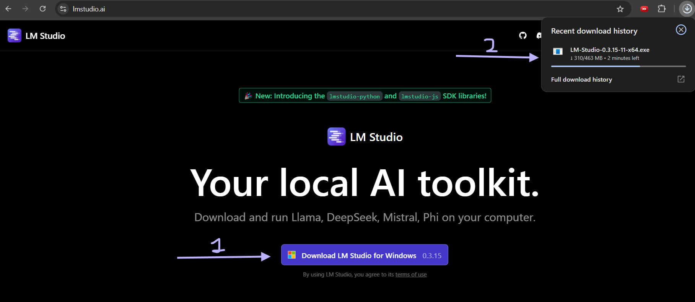
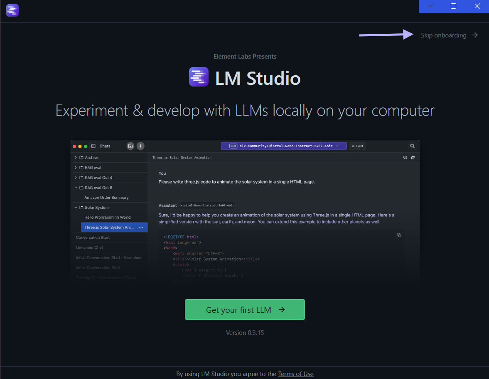
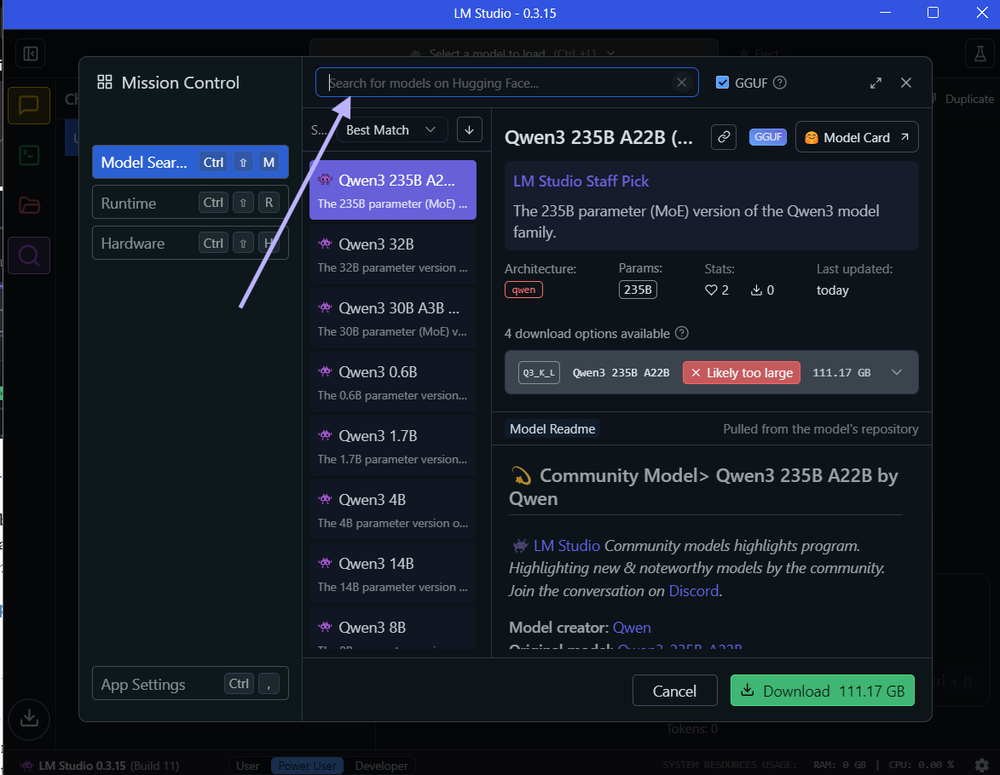
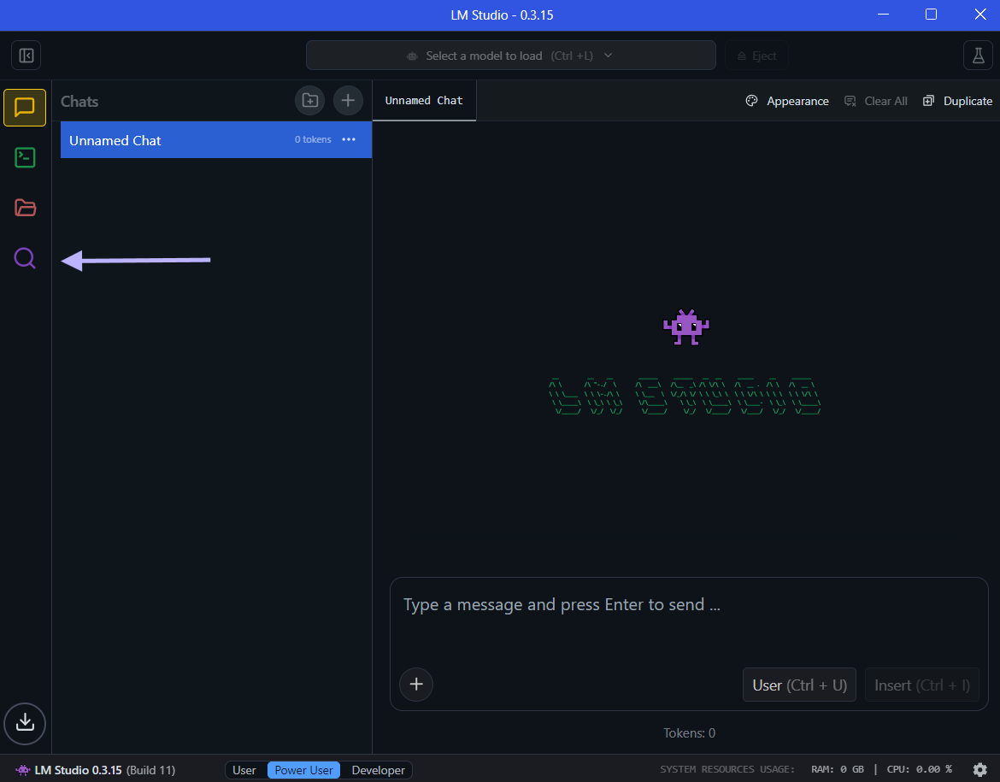

```{r setup, include=FALSE}
knitr::opts_chunk$set(echo = FALSE, warning = FALSE, message = FALSE)
```

# Course Prerequisites: Installation of LM Studio

For the hands-on activities in this course, it is essential that you have LM Studio installed on your computer. LM Studio provides an easy-to-use interface to run local large language models (LLMs) without requiring advanced technical skills.

Please follow these instructions carefully.

## 1. System Requirements

Before installing LM Studio, ensure your machine meets the following minimum requirements:

- **Operating System**: Windows 10/11 (64-bit), macOS 12+, or Linux (Ubuntu 20.04+)
- **RAM**: Minimum 16 GB (32 GB recommended)
- **Disk Space**: At least 20 GB free space
- **GPU (optional)**: A dedicated NVIDIA GPU will improve performance but is not mandatory

## 2. Downloading LM Studio

1. Go to the official website: [https://lmstudio.ai](https://lmstudio.ai)
2. Click on **Download**
3. Select the appropriate version based on your operating system
4. Save the installer file to your computer



## 3. Installing LM Studio

### On Windows:

1. Double-click the downloaded `.exe` file
2. Approve any security prompts
3. Follow the on-screen setup instructions
4. Complete the installation

### On macOS:

1. Open the downloaded `.dmg` file
2. Drag LM Studio into Applications
3. Open from Applications, approve any security prompts

### On Linux:

1. Download the `.AppImage` or `.deb` file
2. Use `chmod +x` and run, or `dpkg -i` for installation via terminal

## 4. First Launch

Open LM Studio after installation. You may need to accept terms of service and allow any initial downloads. No account creation is required.



## 5. Downloading a Local Model

1. Open LM Studio
2. Go to the **Models** tab
3. Search for and download a model
   - You can filter by size, rating, and other parameters
4. For beginners, start with a smaller model:
   - Qwen models are available in 8 sizes - you can start with the smallest one (0.6B) which is ~1GB
   - Other good starter models include Phi-2, Mistral 7B, or TinyLlama



## 6. Testing the Setup

1. Open the **Chat** tab
2. Select your downloaded model
3. Type a prompt (e.g., "Explain what a complete blood count test shows")
4. Verify that you receive a coherent response



## 7. Troubleshooting

- Ensure your system meets the minimum requirements
- Restart your computer after installation
- If you encounter any issues, visit [https://lmstudio.ai/docs](https://lmstudio.ai/docs) for help

## Notes

- Please bring your laptop with LM Studio pre-installed to class
- If you encounter issues with installation, contact the course instructor before the practical session

Thank you and see you in class!